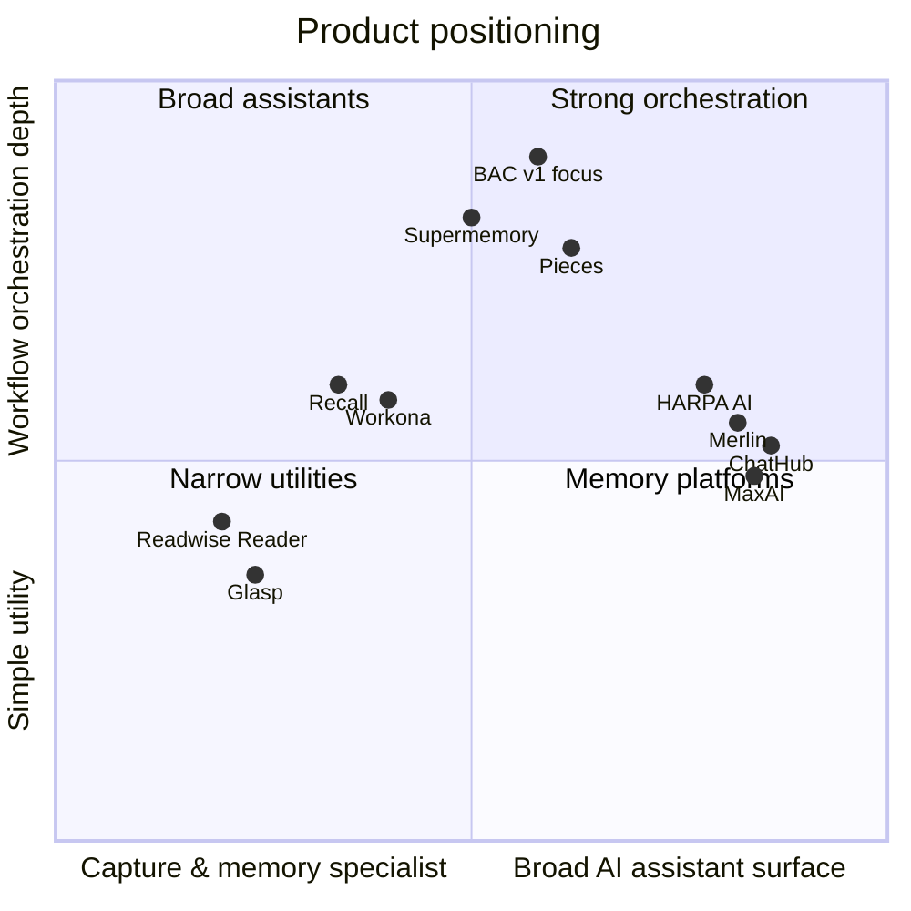
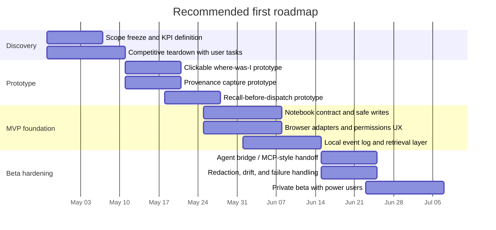

# Browser AI Companion Competitive Review

## Executive summary

Based on the provided brainstorm and scoping artifacts, the proposed product is **not** most defensible as “another AI sidebar,” “another summarizer,” or “another read-it-later/highlighter.” Those categories are already crowded. The strongest commercial overlap sits in two mature clusters: **browser AI assistants** such as HARPA AI, Merlin, MaxAI, and ChatHub, and **capture/memory systems** such as Pieces, Recall, Glasp, Readwise Reader, and Workona. In those areas, the market already offers page-aware chat, PDF/web summarization, browser overlays, saved-content search, resurfaces of prior knowledge, and multi-model access. citeturn0search2turn0search0turn2search0turn13search9turn13search1turn4search1turn10search1turn16search4turn18search3turn15search7

The documents you provided point to a narrower and more novel wedge: a **cross-provider workstream switchboard** that tracks thread state across third-party chat UIs, preserves provenance into a notebook system of record, resurfaces relevant past work before re-dispatch, and exposes that memory to coding agents via MCP-like interfaces. Among the reviewed products, Pieces comes closest on developer memory and agent context, Supermemory comes closest on memory infrastructure and agent plugins, Recall comes closest on personal knowledge resurfacing, and Workona comes closest on workspace/tab state. But none of the reviewed products clearly combine **observed third-party chat orchestration + notebook-grounded provenance + local-first event log + agent bridge** in one coherent offer. That is the main white space. citeturn4search4turn4search6turn17search0turn17search1turn10search1turn15search7turn15search8

The highest-confidence recommendation is therefore to **focus v1 on three moments**, not on a broad assistant surface:  
**capture with provenance**, **where-was-I recovery**, and **déjà-vu/context rehydration before dispatch**. The biggest anti-goal is building commodity features that many incumbents already ship: generic summarization, generic multi-model chat, generic prompt libraries, generic highlighters, and generic tab managers. citeturn0search2turn2search0turn13search9turn13search1turn16search4turn18search3turn15search7

## What the provided scope actually is

The brainstorm does **not** describe a simple “chat with current page” extension. It describes a browser-native orchestration layer for research and coding workflows, with three recurring jobs: coordinating parallel AI threads, capturing reading/chat artifacts into a notebook, and resurfacing prior work later without forcing the user to manually reconstruct context.

From the documents, the **core feature set** clusters into six groups:

| Scope slice | What the documents emphasize |
|---|---|
| Cross-provider workstream orchestration | Track thread state across multiple chat providers, show “where was I?”, push note deltas back into stale threads, and hand off context into coding agents |
| Capture with provenance | Save chat turns, page selections, readable page versions, PDFs, and session artifacts into a notebook with source URL, timestamp, bucket, and thread linkage |
| Memory and recall | Maintain an event log plus notebook-backed recall so the system can surface “you already researched this” before the user re-dispatches |
| Notebook-grounded dashboards | Delegate more UI to the notebook layer, especially with entity["organization","Obsidian","note taking software"] as the canonical v1 anchor, rather than rebuilding every dashboard in the extension |
| Privacy and local-first controls | Keep logs local by default, avoid full-DOM capture/screenshots by default, and make redaction and safe injection core primitives |
| Agent bridge | Expose context to coding agents and external tools, not just to browser chat surfaces |

The **primary user personas** in the documents are also clear. The first is the multi-provider power user who has many AI tabs open and wants to stop re-explaining context. The second is the solo developer or coding-agent user who needs to move context between browser research, notes, and terminal-based agents. Secondary personas include researchers, journalists, consultants, and—later—small teams.

The **highest-salience use cases** are concrete enough to scope an MVP:  
save a valuable chat turn into the notebook; highlight text on a page and dispatch it to multiple targets; detect that a note has drifted away from one or more open threads; recover the state of a dormant workstream; assemble a context pack for a coding agent; and surface a prior related note before the user asks the same question again.

The **technical requirements** implied by the documents are substantial but coherent: browser extension architecture, content scripts/adapters, local storage and indexing, notebook sync, provenance schema, recall ranking, selective permissions, and a plugin/integration layer that can eventually bridge into local coding agents. The provided materials also converge on a strong implementation opinion: use the notebook as a first-class system of record rather than as a dumb export sink.

The **success metrics** are the least mature part of the current scope. The documents articulate qualitative outcomes well—less re-explaining, fewer lost threads, more reliable provenance, and faster return-to-context—but they do **not** yet define explicit quantitative KPIs. That is an important gap. For the next scoping pass, I would formalize at least: time-to-rehydrate a workstream, fraction of saves that preserve usable provenance, recall relevance rate, and reduction in repeated prompts across providers.

## Commercial landscape

### Closest commercial products

| Company | Product | Pricing tiers | Target customer | Core features most relevant to your scope | Integrations / deployment | Maturity / traction | Official sources |
|---|---|---|---|---|---|---|---|
| entity["company","HARPA AI Technologies Oy","browser ai company"] | HARPA AI | Free demo; paid individual, team, and lifetime plans on reviewed pricing page | Browser-heavy knowledge workers and web automation users | Page-aware AI sidebar, multi-model access, web session connections to ChatGPT/Claude/Gemini, PDF/file/video summarization, automation, saved chat history | Browser extension; cloud + web-session + API connections | Growth-stage; official site says “500,000 professionals,” and the Chrome listing shows hundreds of thousands of users | citeturn0search2turn0search0turn0search1 |
| entity["company","Foyer Tech","merlin ai company"] | Merlin AI | Reviewed pricing surfaced a $19/mo annualized plan; additional quotas and query accounting are documented | General users and researchers wanting one AI layer across the web | Multi-model browser assistant, webpage/PDF/video chat, Google-search augmentation, “Vaults” and “Projects” for knowledge bases, custom chatbots | Browser extension, web, mobile; SaaS | Established growth; Chrome listing shows about 1,000,000 users | citeturn2search0turn14search6turn14search5turn14search11 |
| entity["company","ChatHub","multi model ai client"] | ChatHub | Pro and Unlimited plans on reviewed pricing page | Users who want side-by-side answers from multiple models | Simultaneous multi-model chat, web access, image/file chat, prompt library, full-text chat history, code preview, mobile apps | Web app and mobile; SaaS | Growth-stage; broad model coverage, but reviewed official pages did not prominently disclose user count | citeturn13search9turn13search10turn13search3turn1search0 |
| entity["company","MaxAI","browser ai assistant company"] | MaxAI | Free, Pro, and Elite on reviewed pricing page | Users wanting a browser-layer AI assistant for search, read, and write tasks | Browser sidebar, summarize/chat with pages, PDFs and screenshots, multiple frontier models, writing assistants, prompt library, translation, web-linked answers | Browser extension and web app; SaaS with BYO-key options for some usage | Established growth; official pricing page says 1M+ active users and 14K+ 5-star ratings; Chrome listing shows ~800K users | citeturn13search1turn1search1turn11search6 |
| entity["company","Mesh Intelligent Technologies","developer productivity company"] | Pieces for Developers | Free and Pro; reviewed support pages quote Pro around the high-teens per month | Developers and coding-heavy users | OS-level long-term memory, browser/IDE integrations, context-aware copilot, MCP feature set, on-device and cloud model options, browser capture of code/web content | Desktop-first with browser and IDE plugins; local-first with optional cloud | Mature niche; official site reports 1M+ saved materials, 17M+ context points, and 5M+ copilot messages | citeturn4search1turn4search4turn4search6turn4search2turn11search8 |
| entity["company","Supermemory","memory api company"] | Supermemory | Free, Pro, Scale, Enterprise | Developers building AI memory and users wanting shared memory across AI tools | Memory graph, retrieval, extractors, connectors, plugins for Claude Code/Cursor/OpenCode/OpenClaw, Chrome extension, personal memory spanning tools | API + plugins + extension; SaaS with self-hostable enterprise option | Emerging but strategically relevant; official site claims 10,000+ power users and 100B+ tokens processed monthly | citeturn17search0turn17search1 |
| entity["company","Readwise","reading workflow company"] | Readwise Reader | Trial, Lite, and full Readwise/Reader plans on reviewed pricing pages | Heavy readers and note-taking power users | Read-it-later, browser saving, highlight review, offline/full-text search, export to note apps including Obsidian, spaced repetition | SaaS web/mobile/desktop + browser extension | Established niche product with strong docs and export ecosystem; reviewed pages did not highlight a broad user-count metric | citeturn3search1turn3search2turn18search2turn18search1turn15search6 |
| entity["company","Glasp","social highlighting company"] | Glasp | Free, Pro, Unlimited | Learners, researchers, and public-note/highlight users | Web/PDF highlighting, YouTube summaries, notes, export and sync, AI summaries, social discovery, AI clone angle | Browser extension + web/mobile; SaaS | Growth-stage; official pricing page says 1,000,000+ users and Chrome extension shows ~500,000 users | citeturn16search4turn5search0turn16search0 |
| entity["company","Workona","workspace software company"] | Workona | Free, Pro, Team, Enterprise | Tab-heavy knowledge workers and teams coordinating across SaaS apps | Spaces/workspaces, tab/session restore, universal search, integrations with Drive, Slack, Asana/Trello, shared project spaces | Web app plus optional browser extension; SaaS | Established; Chrome extension shows ~200,000 users and strong review volume | citeturn15search7turn6search0turn6search2turn15search0turn15search8turn12search9 |
| entity["company","Recall Wiki","knowledge app company"] | Recall | Lite, Plus, Business | Individuals building AI-assisted personal knowledge bases | Save/summarize articles, videos, podcasts, PDFs and notes; automatic categorization and knowledge graph; spaced repetition; augmented browsing; chat across saved content | Browser extension + web/mobile; cloud product with local-first augmented browsing element | Growth-stage; official site says 500,000+ professionals and Chrome extension shows ~90,000 users | citeturn10search1turn10search0turn12search6turn10search2 |

A few **adjacent substitutes** matter strategically even though I did not include them in the detailed table above. entity["company","Perplexity AI","ai search company"]’s Comet is moving browser behavior closer to built-in research assistance, including personal search and browser commands, while entity["company","The Browser Company","browser software company"]’s Dia is moving toward “chat with your tabs” and inline AI help. I treat both as adjacent substitutes rather than direct competitors because they are AI browsers, not notebook-grounded orchestration layers, but they do increase pressure on any generic “AI in the browser” story. citeturn7search1turn7search3turn8search3turn8search1

### What the commercial landscape means

If you enter the market with a pitch like **“one AI sidebar for reading, writing, searching, PDFs, and multiple models”**, you will be competing head-on with HARPA AI, Merlin, MaxAI, ChatHub, and adjacent players like Sider. That battle is already crowded, feature-dense, and strongly optimized around convenience. citeturn0search2turn2search0turn13search9turn13search1

If you enter with a pitch like **“save things, summarize them, and find them later”**, you will still face heavy overlap from Recall, Readwise Reader, Glasp, Pieces, Linkwarden/Karakeep-style tools, and even Workona from the workspace state angle. citeturn10search1turn18search3turn16search4turn4search1turn15search7

The more promising wedge is therefore not generic assistance or generic memory. It is the **workflow glue** between existing places where users already think and work: third-party chat threads, a notebook system of record, and coding agents. Pieces and Supermemory show that memory plus agent context is commercially valuable. Workona shows that project/workspace state is valuable. Recall shows that resurfacing saved context is valuable. Your opportunity is to combine those value pools without collapsing into a general-purpose assistant. citeturn4search6turn17search0turn15search7turn10search1

## Open-source landscape

### Closest open-source projects

| Project | License | Activity snapshot | Feature parity vs your scope | Deployment / community health | Official source |
|---|---|---|---|---|---|
| entity["organization","WorldBrain","research software org"] Memex | MIT | ~4.6k stars, ~360 forks; repo updated March 2025 in reviewed pages | **High on capture, search, annotation, tab/bookmark recall; low on multi-provider chat orchestration and coding-agent bridge** | Browser-extension-first; long-lived project with contributor base and mobile/sync story | citeturn24search2turn24search1 |
| entity["organization","Karakeep App","bookmarking software org"] Karakeep | AGPL-3.0 | ~21k stars, ~900+ forks; recent releases and active package downloads in reviewed pages | **Medium-high on link/note/image/PDF capture, AI tagging, OCR, search, collaboration; low on chat-thread orchestration** | Self-hosted; active releases and healthy community usage | citeturn28search1turn29search0turn29search1turn29search4 |
| entity["organization","Linkwarden","bookmark manager org"] Linkwarden | AGPL-3.0 | ~18k stars, ~700+ forks; active repo in reviewed pages | **Medium-high on collection, preservation, annotation, collaboration, extension capture; low on chat orchestration and agent bridge** | Self-hosted + official cloud; active community projects and extension ecosystem | citeturn24search3turn24search5turn24search0 |
| entity["organization","Open WebUI","self hosted ai org"] Open WebUI | Mixed / Open WebUI License | ~132k stars, ~18k forks; updated April 2026 in reviewed pages | **Medium on multi-model AI workspace, RAG, self-hosting, MCP-adjacent extensibility; low on browser-native thread observation and notebook provenance** | Very large community, broad deployment options including Docker/Kubernetes/Desktop | citeturn25search2turn25search0turn25search4 |
| entity["organization","LobeHub","agent workspace org"] LobeHub | LobeHub Community License | ~75k stars, ~14.9k forks; latest release April 2026 in reviewed pages | **Medium on multi-model workspaces, knowledge bases, MCP marketplace, self-hosting; low on browser-observed thread management and notebook-grounded state** | Large and active community; mature release cadence and self-host options | citeturn25search1turn25search5 |
| entity["organization","Hypothesis","web annotation org"] client | BSD-2-Clause | ~679 stars, ~213 forks on client repo; active org | **Low-medium overall parity, but high value as an annotation/provenance reference point** | Mature annotation ecosystem; browser extension and embeddable client | citeturn26search1turn26search3 |
| entity["organization","Zotero","research software org"] | AGPL | ~13.9k stars, ~1k forks; updated April 2026 in reviewed pages | **Medium on source capture, organization, annotation, citation, and browser connectors; low on AI thread orchestration** | Very mature research tool with browser connectors and rich surrounding ecosystem | citeturn26search2turn26search0 |
| entity["organization","Memos","note taking org"] | MIT | ~59k stars, ~4.3k forks; updated April 2026 in reviewed pages | **Low-medium on quick capture and portable note storage; low on browser orchestration, thread registry, and recall sophistication** | Strong self-host community; simple deployment and active package downloads | citeturn27search2turn27search0turn27search4 |
| entity["organization","Logseq","knowledge platform org"] | AGPL-3.0 | ~42k stars, ~2.6k forks; repo updated January 2026 in reviewed pages | **Low-medium on local-first knowledge management and plugins; low on browser-native orchestration and multi-chat management** | Large PKM community and plugin ecosystem; local-first posture aligns strongly with your documents | citeturn27search3turn27search1 |

### What the open-source landscape means

Open source already covers a **lot** of the surface area you are considering, but mostly in **slices**, not in the exact integrated shape from your documents.

Memex, Karakeep, and Linkwarden are the clearest warnings against reinventing capture, read-it-later, annotation, archive, and search. Open WebUI and LobeHub are the clearest warnings against reinventing generic multi-model AI workspaces or MCP/plugin marketplace patterns. Zotero, Memos, and Logseq are reminders that portable, user-owned note systems are already mature expectations, not a novelty. citeturn24search2turn28search1turn24search3turn25search2turn25search1turn26search2turn27search2turn27search3

That means the open-source risk is not “someone already built your exact product.” The risk is “many pieces already exist, so users will punish you if you rebuild them badly.” Your design should therefore treat mature OSS capabilities as **baseline inputs** to your product strategy, not as optional inspiration. citeturn24search2turn24search3turn25search2turn26search1

## Feature coverage and differentiation

### Coverage matrix for commercial products

Legend: **✓** strong/native, **△** partial or adjacent, **—** not visible in reviewed materials.

| Product | Orchestrate across AI surfaces | Capture page/chat artifacts | Notebook / export integration | Recall / resurfacing | Workspace / thread state | Coding-agent / MCP bridge | Local-first / user-owned posture | Automation / agents |
|---|---:|---:|---:|---:|---:|---:|---:|---:|
| HARPA AI | △ | ✓ | △ | △ | — | — | △ | ✓ |
| Merlin AI | △ | ✓ | △ | △ | — | — | — | △ |
| ChatHub | ✓ | △ | △ | △ | — | — | — | — |
| MaxAI | △ | ✓ | — | △ | — | — | — | △ |
| Pieces | △ | ✓ | △ | ✓ | △ | ✓ | ✓ | △ |
| Supermemory | △ | ✓ | △ | ✓ | △ | ✓ | △ | ✓ |
| Readwise Reader | — | ✓ | ✓ | ✓ | — | — | — | — |
| Glasp | — | ✓ | ✓ | △ | — | — | — | — |
| Workona | — | △ | △ | △ | ✓ | — | — | △ |
| Recall | — | ✓ | △ | ✓ | △ | — | △ | △ |

The matrix shows three things. First, “AI assistant in the browser” is already dense. Second, “capture and resurfacing” is also dense. Third, the **combination** of **thread/workspace state + notebook-grounded provenance + agent bridge** remains relatively thin. Pieces and Supermemory are the most strategically important comparators because they already monetize memory-plus-agent context, but they still do not appear to own the exact browser-observed, cross-provider thread-state problem your documents center on. citeturn4search4turn4search6turn17search0turn17search1turn15search7turn10search1

### Coverage matrix for open-source projects

Legend: **✓** strong/native, **△** partial or adjacent, **—** not visible in reviewed materials.

| Project | Browser capture / annotation | Saved-content search / recall | Notebook / knowledge base role | Multi-model AI workspace | Workspace / thread registry | Agent / MCP extensibility | Self-host / local-first |
|---|---:|---:|---:|---:|---:|---:|---:|
| Memex | ✓ | ✓ | △ | — | △ | — | △ |
| Karakeep | ✓ | ✓ | △ | — | △ | △ | ✓ |
| Linkwarden | ✓ | ✓ | △ | — | △ | △ | ✓ |
| Open WebUI | △ | ✓ | △ | ✓ | △ | ✓ | ✓ |
| LobeHub | △ | ✓ | △ | ✓ | △ | ✓ | ✓ |
| Hypothesis client | ✓ | △ | △ | — | — | — | △ |
| Zotero | ✓ | ✓ | ✓ | — | △ | △ | △ |
| Memos | △ | △ | ✓ | — | — | △ | ✓ |
| Logseq | △ | △ | ✓ | — | △ | △ | ✓ |

The OSS matrix reinforces the same answer: there is no obvious full duplicate, but there are many **good component-level precedents**. Rebuilding annotation, archival capture, simple knowledge stores, or generic agent workspaces from scratch would create unnecessary risk because mature reference implementations already exist. citeturn24search2turn28search1turn24search3turn25search2turn25search1turn26search1turn26search2turn27search2turn27search3

### Positioning diagram

Interpretation: the crowded right side is the generic-assistant market; the crowded lower-left is capture/memory. The least crowded position from your documents is **high orchestration, medium-breadth workflow glue** rather than a maximalist assistant. That is where your proposal differentiates best from the reviewed field. citeturn0search2turn2search0turn13search9turn13search1turn4search4turn17search0turn10search1turn15search7

## Recommendations and roadmap

### Strategic recommendations

Your best move is to treat the product as a **workflow coordination layer**, not as a universal intelligence layer. In practice, that means:

1. **Focus on the switching cost you can remove that others do not**: recovering thread state across providers, exporting/importing context with provenance, and surfacing prior related work before the user spends time or tokens again.
2. **Use the notebook as a first-class system of record** because your documents already converge on that architecture, and because mature capture/memory tools show that users care about ownership, longevity, and exportability. The product should enrich the notebook rather than compete with it.
3. **Make the coding-agent bridge strategic, not cosmetic.** Pieces and Supermemory show that memory becomes more valuable when agents can consume it directly. That is a strong place to differentiate. citeturn4search6turn17search0turn17search1

### Features to avoid duplicating

The following areas look like poor places to spend early engineering effort because the market is already dense:

- **Generic page/video/PDF summarization and rewriting.** HARPA AI, Merlin, MaxAI, and Glasp already sell this heavily. citeturn0search2turn2search0turn13search1turn16search4
- **Generic multi-model chat surfaces.** ChatHub, Merlin, MaxAI, Open WebUI, and LobeHub already cover this. citeturn13search9turn2search0turn13search1turn25search2turn25search1
- **Generic bookmark/highlight/archive systems.** Recall, Readwise Reader, Glasp, Karakeep, Linkwarden, and Memex already occupy this territory. citeturn10search1turn18search3turn16search4turn28search1turn24search3turn24search2
- **Generic tab managers/workspaces.** Workona is already strong here. citeturn15search7turn12search9

### Open-source components and patterns worth leveraging

The OSS review suggests a practical build strategy:

- Borrow the **annotation and on-page anchoring mentality** from Hypothesis and Memex rather than inventing a brand-new annotation worldview. citeturn26search1turn24search2
- Reuse the **self-hosted archival/search baseline** already proven by Karakeep and Linkwarden for storage, full-text search, archival copies, and browser-save flows. citeturn28search1turn24search3
- Study **Open WebUI** and **LobeHub** for plugin and MCP-adjacent workspace patterns, but avoid cloning their entire assistant-workspace surface. citeturn25search2turn25search1
- Treat **Zotero**, **Memos**, and **Logseq** as evidence that portability, self-hosting, and durable user-owned knowledge structures are table stakes for many power users. citeturn26search2turn27search2turn27search3

### Go-to-market suggestion

The highest-confidence initial segment is the one your documents already imply: **multi-provider AI power users who also keep serious notes and increasingly use coding agents**. Commercially, that sits closest to the overlap between Pieces users, Recall-style knowledge workers, and Workona-style tab-heavy researchers—but with a sharper browser-native orchestration story. citeturn4search4turn10search1turn15search7

A strong initial message is not “AI for everything in your browser.” It is closer to: **stop losing threads, stop re-explaining context, and stop rebuilding the same research state in three places.** That message is narrower, but it is far more defensible against the incumbent assistant tools.

### Prioritized action list

1. **Freeze the wedge.** Lock v1 to thread-state recovery, provenance-rich capture, and recall-before-dispatch.  
2. **Do not ship a generic assistant surface first.** Keep summarization/rewrite utilities secondary or deferred.  
3. **Instrument explicit KPIs.** Add quantitative success metrics before coding: rehydrate time, recall precision, capture success rate, and repeated-prompt reduction.  
4. **Prototype the “where was I?” panel early.** That is the most differentiating moment in the documents.  
5. **Build the notebook contract before the AI integrations sprawl.** The storage and provenance model is the durable moat.  
6. **Treat the coding-agent bridge as a strategic layer, not a nice-to-have.**  
7. **Adopt rather than rebuild mature OSS patterns** for archival capture, annotation, and self-hosted search.  
8. **Leave team collaboration for later** unless discovery proves that teams—not individual power users—are the real early buyers.

### Suggested roadmap

### Open questions and limitations

A few constraints materially affect the conclusions.

The provided documents are rich but still at brainstorm/scoping level rather than a finalized PRD, so some late-scope items remain mutually competing rather than fully reconciled. The industry, target market, budget, and final tech stack were also intentionally unspecified, which means the recommendations above are optimized for the **best-supported cross-market wedge**, not for a particular vertical.

In addition, some adjacent products—especially very broad AI sidebars and AI browsers—were easier to verify for feature overlap than for clean official pricing capture in this session. I therefore emphasized the products whose official pages, pricing, and repo/store evidence were clearest, rather than padding the report with lower-confidence rows.

The central bottom line still holds: **building another generic browser AI assistant would likely duplicate existing products; building a cross-provider workstream switchboard with notebook-grounded provenance and agent-facing memory still looks differentiated.**