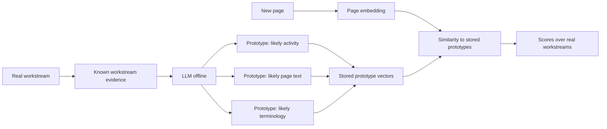
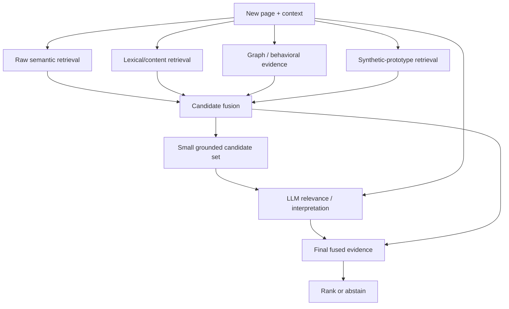

# HyDE-Style Hypothetical Representations for Switchboard-Style Workstream Attribution

## Executive summary

**Bottom line.** The research literature supports HyDE-style generation as a useful way to bridge a **representation mismatch**: an input is expressed in one linguistic form, while the objects one wants to retrieve or classify against are expressed in another. The original [HyDE paper](https://aclanthology.org/2023.acl-long.99/) demonstrated that generating a hypothetical relevant document and embedding that generated document can materially improve zero-shot dense retrieval. On TREC DL 2019, for example, HyDE raised Contriever's nDCG@10 from 44.5 to 61.3 and Recall@1k from 74.6 to 88.0; on TREC DL 2020, nDCG@10 rose from 42.1 to 57.9 and Recall@1k from 75.4 to 84.4. The method was also competitive with supervised retrievers without using relevance labels. citeturn23search0turn8view0

The result is **not** that “hallucinating first is universally better than embedding the original input.” A large 2024 study covering 11 expansion techniques, 12 datasets, and 24 retrievers found a strong negative relationship between baseline retriever quality and gains from generative expansion: expansion tended to help weaker retrievers and substantial distribution/format shifts, but could hurt already-strong retrievers by adding noise and false positives. More recent work likewise finds that corpus grounding, retrieval feedback, and the choice of embedding model can matter at least as much as hypothetical generation itself. citeturn23search5turn26search0

For **Switchboard-style attribution**, the most important distinction is that a workstream is not an open-domain document. It is a **private, user-defined, evolving semantic target**. A page about “retrieval relevance feedback” may belong to a workstream whose name has no meaningful public semantics at all. Pure query-side HyDE depends heavily on the generator's pretrained knowledge to invent the right intermediate representation; ReDE-RF was motivated explicitly by this weakness, arguing that HyDE may fail where the LLM lacks domain-specific knowledge. Corpus-Steered Query Expansion independently reports that corpus grounding is especially useful for queries about things the LLM does not know. citeturn27academia24turn24search1

That makes **reverse prototype generation** unusually interesting for this problem. Instead of generating a hypothetical workstream description for every new page, generate several workstream-shaped example texts from each *real* workstream and its known evidence, embed those offline, and match new pages against those prototypes. This is not exactly the original HyDE algorithm, but it has strong analogues in three research lines: document-side query generation such as [Doc2Query](https://arxiv.org/abs/1904.08375), LLM-generated class prototypes such as [HierPrompt](https://aclanthology.org/2025.findings-emnlp.207/), and the very recent index-time [Hypothetical Prompt Embeddings, HyPE](https://arxiv.org/abs/2607.29402), which deliberately moves hypothetical generation from query time to indexing time. citeturn25academia11turn25search0turn17academia23

The most consistent evidence across the broader literature, however, favors **hybrids rather than replacing the original signal**. Generative Relevance Feedback and ordinary pseudo-relevance feedback have complementary strengths; their combination significantly increased recall over PRF in 95% of reported experiments. MILL mutually verifies generated and retrieved documents. CSQE injects corpus-originated passages into LLM expansion. ReDE-RF goes further by replacing hypothetical generation with LLM-selected *real* documents. LlamaIndex's engineering implementation defaults to retaining the original query alongside the hypothetical representation. citeturn24academia37turn24search4turn24search1turn27academia24turn26search2

For Switchboard, therefore, the literature supports the following **research interpretation**, not a product prescription:

> **Hypothetical representations are best understood as an additional semantic coordinate system. Their strongest prospective value is on cold or semantically displaced inputs, while their greatest risk is allowing an LLM's plausible but private-domain-incorrect interpretation to overwhelm grounded evidence.**

This fits naturally with a multi-signal attribution setting rather than a monolithic classifier. The connected Switchboard repository contains a dedicated `guessLanes.ts` attribution component and a separate recall pipeline, and it already has a prequential attribution evaluator, making independent comparison of signals conceptually well aligned with the existing experimental structure. fileciteturn4file3 fileciteturn4file10 fileciteturn5file0

The evidence strength is asymmetric:

| Research proposition | Evidence strength for generic retrieval | Evidence strength for Switchboard-style workstreams |
|---|---:|---:|
| Query → hypothetical document can improve zero-shot retrieval | **Strong** | **Moderate, indirect** |
| Generative expansion helps especially under representation/domain mismatch | **Strong** | **Strong conceptual fit** |
| Pure HyDE is reliable for private/idiosyncratic labels | **Weak / contrary evidence exists** | **Weak** |
| Target-side synthetic examples can improve semantic classification | **Moderate–strong** | **Promising but indirect** |
| Moving generation offline reduces online latency | **Strong** | **Directly applicable engineering fact** |
| Combining generated and grounded signals is more robust than replacing grounded retrieval | **Strong** | **Strong conceptual fit** |
| HyDE/prototypes improve “cold pages” specifically | **Not directly studied** | **Requires application-specific evaluation** |
| A hypothetical signal should be authoritative | **Unsupported** | **Unsupported** |

The principal research gap is important: **I found no published benchmark that exactly matches “given a newly visited web page plus browsing context, assign it to one of a person's private evolving workstreams.”** Consequently, claims about actual Switchboard Top-1 accuracy or cold-page gains remain hypotheses to be tested, not conclusions to import from RAG benchmarks.

## Foundations: HyDE and the HN proposal

### What the original HyDE paper actually does

Gao, Ma, Lin, and Callan's [“Precise Zero-Shot Dense Retrieval without Relevance Labels”](https://aclanthology.org/2023.acl-long.99/) introduced Hypothetical Document Embeddings as a way around a difficult zero-shot problem: a query encoder has to map a short query directly into the neighborhood occupied by relevant corpus documents, even though queries and documents differ substantially in language, form, and information density. HyDE instead asks an instruction-following LLM to write something resembling a document that *would* answer the query, embeds that generated document with an unsupervised dense encoder such as Contriever, then finds real documents near that vector. The hypothetical document can contain factual hallucinations; the authors' hypothesis is that the dense encoding bottleneck preserves useful relevance patterns while suppressing enough fine-grained hallucinated detail to land in the right corpus neighborhood. citeturn23search0

Conceptually:

The subtle point is that the LLM does **not** have to produce a correct answer in the ordinary generative sense. It has to produce text whose *representation* lands near real relevant documents. HyDE therefore uses generation as a **representation transformation**, rather than treating generated prose as evidence. citeturn23search0

The original experiments used MAP, nDCG@10, high-cutoff recall such as Recall@1k/Recall@100, and MRR@100 depending on dataset. HyDE was tested on TREC Deep Learning, seven BEIR low-resource tasks, and multilingual Mr.TyDi retrieval. citeturn8view0turn8view1

Its TREC results make the mechanism worth taking seriously:

| System | DL19 nDCG@10 | DL19 R@1k | DL20 nDCG@10 | DL20 R@1k |
|---|---:|---:|---:|---:|
| BM25 | 50.6 | 75.0 | 48.0 | 78.6 |
| Contriever | 44.5 | 74.6 | 42.1 | 75.4 |
| **HyDE** | **61.3** | **88.0** | **57.9** | **84.4** |
| Supervised Contriever-ft | 62.1 | 83.6 | 63.2 | 85.8 |

These are not marginal changes: on DL19 the unsupervised Contriever-to-HyDE shift produced a 16.8-point nDCG@10 gain and 13.4-point Recall@1k gain. At the same time, DL20 shows the limit of the claim: the supervised Contriever remained stronger in nDCG@10. citeturn8view0

The generator also mattered. The paper's generator ablations found positive gains with several LLMs but stronger results with the more capable generator used in the main system; additionally, adding HyDE to already-supervised encoders still helped in some configurations, although the marginal benefit became smaller. That foreshadows the later literature's conclusion that HyDE's value is conditional on the quality and representation gap of the underlying retriever. citeturn8view1turn8view2

### How the HN “hypothetical classification” idea changes the abstraction

The linked [Hacker News discussion](https://news.ycombinator.com/item?id=49249523) takes essentially the same representation trick and applies it to **classification vocabulary** instead of answer-document vocabulary. The HN page itself returned a crawler cache miss in this research session, so I cannot honestly present a fresh line-by-line scrape of every comment; the thread-specific points below are therefore separated from sources I could independently verify. citeturn19view0

The underlying mechanism is independently documented in Doug Turnbull's [“Semantic Search Without Embeddings”](https://softwaredoug.com/blog/2026/01/08/semantic-search-without-embeddings). His example starts with a product query such as “hobby horse” and a large managed Wayfair-style taxonomy. Instead of either directly embedding the short query or forcing an LLM to choose one exact valid taxonomy node, the LLM is asked to invent plausible *fake classifications that look linguistically like the real taxonomy*. A generated phrase such as a detailed “Baby & Kids / … / Hobby Horses” path can then be embedded and used to retrieve the nearest *real* classifications. Turnbull explicitly argues that a small model can be sufficient in this setting because the generation step is being asked for linguistic creativity and approximate taxonomy language rather than trustworthy factual classification. citeturn22search1

That gives three related but distinct transformations:

\[
\text{ordinary embedding classification:}\quad
x \rightarrow e(x) \rightarrow \operatorname{nearest\ real\ label}
\]

\[
\text{HyDE:}\quad
q \rightarrow G(\text{hypothetical relevant document}\mid q)
\rightarrow e(h) \rightarrow \operatorname{real\ document}
\]

\[
\text{hypothetical classification:}\quad
x \rightarrow G(\text{plausible label-like text}\mid x)
\rightarrow e(h) \rightarrow \operatorname{real\ label}
\]

The attractive common principle is **representation-language alignment**: generation converts the source into language resembling the target before similarity is measured. HyDE converts query language into document language; the HN proposal converts natural user/page language into taxonomy language. This is consistent with Query2doc, which generates pseudo-documents to improve both sparse and dense retrieval, and with newer label-semantics work that generates semantic descriptions and then maps them back to predefined labels. citeturn23search2turn27search1

The most consequential HN comment themes were not “hallucination is always good,” but qualifications remarkably consistent with the research published around the same idea:

**First, generated representations rely on the model having the right prior.** This is much less problematic for familiar objects such as furniture categories than for private concepts. ReDE-RF identifies essentially this as a core HyDE limitation: a hypothetical document requires the generator to possess domain knowledge, whereas judging the relevance of retrieved real documents requires much less parametric domain knowledge. Turnbull himself makes a parallel engineering point elsewhere: generic models can confidently misunderstand private terminology—for example, an acronym that means something idiosyncratic inside one organization—and need actual contextual grounding. citeturn27academia24turn22search7

**Second, the direction can be reversed.** Instead of `input → fake category → real category`, generate representative inputs *from the categories* and index those. That HN suggestion has substantial precedent: Doc2Query generates likely queries for documents at indexing time, HierPrompt generates detailed example texts for each category, and HyPE generates likely questions/prompts for corpus chunks before serving queries. citeturn25academia11turn25search0turn17academia23

**Third, do not throw away the original signal.** One HN suggestion was effectively to search using both the original input and hypothetical interpretation. This is supported experimentally by GRF+PRF, by MILL's mutual verification of retrieved and generated documents, and operationally by LlamaIndex's `HyDEQueryTransform`, whose `include_original` option defaults to `True`. citeturn24academia37turn24search4turn26search2

**Fourth, retrieval can precede generation instead of following it.** CSQE first retrieves corpus documents and selects pivotal corpus sentences to steer expansion; ReDE-RF first retrieves candidates and asks an LLM for relevance decisions, then represents the query using real relevant-document embeddings. This addresses exactly the failure mode where a generator invents a plausible but locally wrong semantic interpretation. citeturn24search1turn27academia24

For Switchboard, these caveats are more important than the catchy “hallucinate” framing because **a private workstream taxonomy is almost the adversarial case for pretrained semantic priors**.

## Research landscape and empirical evidence

### Query-side hypothetical generation

[Query2doc](https://aclanthology.org/2023.emnlp-main.585/) is closely related to HyDE but expands the original query with an LLM-generated pseudo-document instead of using only the hypothetical document as a dense-search pivot. On ad-hoc retrieval datasets including MS MARCO and TREC DL, it improved BM25 by roughly 3–15% without retriever fine-tuning and also improved dense retrieval both in- and out-of-domain. This is important because it shows the generated text can help **lexical retrieval as well as dense retrieval**: one benefit is simply inventing terminology that closes the query–corpus vocabulary gap. citeturn23search2

[Generative Relevance Feedback](https://arxiv.org/abs/2304.13157) explored several forms of LLM-generated expansion—queries, entities, facts, news, documents, essays—and reported improvements over RM3 pseudo-relevance feedback of roughly 5–19% in MAP and 17–24% in nDCG@10, while obtaining the strongest R@1k among the evaluated systems. Its significance for workstream attribution is not the specific benchmark numbers but the finding that **different generated semantic views can enrich recall even without useful first-pass results**. citeturn24academia36

The follow-up [Generative and Pseudo-Relevant Feedback](https://arxiv.org/abs/2305.07477) is arguably even more relevant. Across six document-ranking benchmarks, generative feedback improved over comparable PRF techniques by about 10% on precision- and recall-oriented metrics, but the authors found the two techniques had complementary query-level strengths: generation contributed external context from the LLM, whereas PRF contributed corpus grounding. Combining them significantly improved recall over PRF in 95% of the reported experiments. citeturn24academia37

[Generative Relevance Modeling](https://arxiv.org/abs/2306.09938) directly attacks generated-noise problems by finding real documents near each generated document and using a neural reranker to estimate how relevant those generated expansion signals really are. It reported MAP gains of 6–9% and R@1k gains of 2–4% over previous methods on three benchmarks. The design is notable because it treats generated content as a **proposal requiring corpus-side validation**, rather than as reliable semantic truth. citeturn24academia38

### Corpus-grounded HyDE relatives

[Corpus-Steered Query Expansion](https://aclanthology.org/2024.eacl-short.34/) begins from the observation that LLM-generated pseudo-documents can mismatch a corpus because of hallucinated or outdated knowledge. It therefore retrieves documents first, asks the LLM to identify pivotal sentences in those documents, and combines corpus-originated text with LLM-generated expansion. The authors report particularly strong behavior on queries for which the LLM itself lacks sufficient knowledge. citeturn24search1

[MILL](https://aclanthology.org/2024.naacl-long.138/) similarly refuses to choose between retrieval-generated context and LLM-generated context. It generates multiple subqueries and corresponding documents, obtains real retrieved documents, and then performs mutual verification to select expansion evidence. The method was evaluated as a fully zero-shot approach on three public benchmarks and outperformed the compared expansion approaches. citeturn24search4

[ReDE-RF](https://arxiv.org/abs/2410.21242) pushes the idea further. Instead of asking an LLM to write a long hypothetical document, it first retrieves candidates, asks the LLM for a one-token relevance decision, and uses embeddings of selected *real* documents to construct the search representation. The authors explicitly motivate the approach by two HyDE weaknesses: dependency on LLM domain knowledge and the latency of generating many tokens. ReDE-RF reports stronger zero-shot retrieval across low-resource retrieval datasets while substantially reducing per-query latency. citeturn27academia24

This family of results suggests that “HyDE versus retrieval” is the wrong dichotomy. A more general architecture is:

\[
\text{generator prior} + \text{corpus evidence} + \text{retriever representation}
\]

with different systems choosing different locations for generation and grounding.

### Target-side generation and synthetic prototypes

The reverse direction predates HyDE. Nogueira et al.'s [Doc2Query](https://arxiv.org/abs/1904.08375) predicts queries that a document is likely to answer, adds those queries to the document at indexing time, and thereby moves neural generation out of the latency-critical retrieval path. With a reranker it reached state-of-the-art results on two retrieval tasks; in the latency-sensitive retrieval-only setting it approached substantially more expensive neural rerankers while remaining much faster. citeturn25academia11

That idea has persisted in production-oriented work. Walmart's [Doc2Token](https://arxiv.org/abs/2406.19647) generates only useful tokens missing from an e-commerce document rather than whole queries. The authors report better prediction diversity and efficiency than Doc2Query, and state that the technique was deployed to full Walmart.com traffic after a significant online A/B-test revenue improvement. This is evidence that **offline synthetic target enrichment is not merely an academic trick**, although its e-commerce objective is far removed from personal workstream attribution. citeturn25academia12

The classification literature provides a still closer analogue. [HierPrompt](https://aclanthology.org/2025.findings-emnlp.207/) observes that directly embedding category names is weak because category names can be ambiguous and semantically impoverished. It asks an LLM to contextualize category names and generate detailed **example text prototypes** for each leaf category, then classifies documents via those enriched representations. Across three zero-shot hierarchical text-classification benchmarks it substantially outperformed previous methods. citeturn25search0

Another 2025 method, [Label-semantics Aware Generative Classification](https://aclanthology.org/2025.findings-acl.1145/), attacks the complementary direction: generate semantic descriptions from the input and map them back to predefined label descriptions using a sentence-transformer representation. It reported improvements over its closest baseline averaging 13.94% in Micro-F1 and 24.85% in Macro-F1 across the evaluated datasets. Structurally, this is especially close to the HN “invent a label-like description, then ground it to real labels” proposal. citeturn27search1

The July 2026 [HyPE preprint](https://arxiv.org/abs/2607.29402)—**Hypothetical Prompt Embeddings**—makes the indexing-time analogy explicit. Instead of generating an answer-like hypothetical document for every query, HyPE generates multiple hypothetical prompts/questions for each corpus chunk during indexing, allowing run-time retrieval to compare query-shaped objects. On six datasets the authors report improvements of up to 42 percentage points in context precision and 45 points in claim recall over standard retrieval configurations. These are unusually large claims from a very recent preprint and should be treated as preliminary until independently reproduced, but the architectural result is directly relevant: the expensive generation can be moved from the novel-input side to the stable-target side. citeturn17academia23

### Findings that constrain the enthusiasm

The most important negative result is Weller et al.'s [“When do Generative Query and Document Expansions Fail?”](https://aclanthology.org/2024.findings-eacl.134/). Across 11 expansion techniques, 12 datasets and 24 retrievers, stronger baseline retrieval performance correlated negatively with gains from expansion. Their error analysis suggests generated text can increase recall by injecting additional useful concepts, but can simultaneously blur fine ranking by injecting noise and false positives. Their practical conclusion is to prefer expansion for weaker retrieval systems and substantial distribution/format shifts rather than assume universal benefit. citeturn23search5

A 2026 SemEval study reinforces this. In multi-turn retrieval, HyDE improved a BM25 configuration by 26.7% but its dense-retrieval gain was only 4.0%. More strikingly, switching the dense embedding model from the team's fine-tuned E5 configuration to general-purpose BGE improved the baseline by 30.5%. Their official E5-FT+HyDE submission achieved nDCG@5 of 0.3309 and ranked 31st of 38 submissions. Thus a large HyDE gain on one baseline does not imply HyDE is the dominant system-level variable. citeturn26search0

There is also a benchmark-validity concern. [Yoon et al. 2025](https://aclanthology.org/2025.findings-acl.980/) examined LLM query expansion in fact verification and found that performance improvements were associated with cases where generated hypothetical documents already contained sentences entailed by the gold evidence. They argue this is consistent with benchmark knowledge leakage from LLM pretraining, meaning some apparent “retrieval transformation” benefit may actually be parametric recall of benchmark answers. citeturn17search1

Finally, domain adaptation can alter the picture. [SL-HyDE / AutoMIR](https://aclanthology.org/2025.findings-emnlp.1305/) uses unlabeled target-domain corpora in a self-learning loop to refine both hypothetical-document generation and retrieval. On a medical retrieval benchmark spanning five tasks and ten datasets, it significantly outperformed ordinary HyDE across several LLM/retriever configurations. This indicates that poor private/domain fit is not necessarily intrinsic to hypothetical generation; it can be reduced when the generator itself is adapted or grounded to the target corpus. citeturn23search8

A condensed view of the empirical literature is:

| Study | Technique | Main reported finding | Main metrics |
|---|---|---|---|
| [HyDE, ACL 2023](https://aclanthology.org/2023.acl-long.99/) | Query → hypothetical doc → dense retrieval | Large gains over unsupervised Contriever; often competitive with supervised retrieval | MAP, nDCG@10, Recall@100/1k, MRR@100 citeturn23search0turn8view0 |
| [Query2doc, EMNLP 2023](https://aclanthology.org/2023.emnlp-main.585/) | Query + generated pseudo-doc | BM25 +3–15%; dense gains in/out of domain | MRR/nDCG/recall depending benchmark citeturn23search2 |
| [GRF, 2023](https://arxiv.org/abs/2304.13157) | Generated relevance feedback | MAP +5–19%; nDCG@10 +17–24% vs RM3 | MAP, nDCG@10, R@1k citeturn24academia36 |
| [GRF + PRF, 2023](https://arxiv.org/abs/2305.07477) | Generated + retrieved feedback | Complementary; recall increased over PRF in 95% of experiments | Precision- and recall-oriented IR metrics citeturn24academia37 |
| [Weller et al., EACL 2024](https://aclanthology.org/2024.findings-eacl.134/) | 11 generative expansion methods | Helps weaker/shifted retrieval; often hurts strong retrieval through noise | Multiple standard IR metrics across 12 datasets citeturn23search5 |
| [CSQE, EACL 2024](https://aclanthology.org/2024.eacl-short.34/) | Corpus-steered expansion | Especially useful where LLM lacks query knowledge | Ranking effectiveness across IR benchmarks citeturn24search1 |
| [MILL, NAACL 2024](https://aclanthology.org/2024.naacl-long.138/) | Generated/retrieved mutual verification | Zero-shot improvements over compared QE methods | Retrieval ranking metrics citeturn24search4 |
| [ReDE-RF, 2024](https://arxiv.org/abs/2410.21242) | Retrieved real docs + LLM relevance | Better zero-shot retrieval with lower query latency than long-form HyDE | Retrieval effectiveness + latency citeturn27academia24 |
| [HierPrompt, EMNLP Findings 2025](https://aclanthology.org/2025.findings-emnlp.207/) | LLM-generated class example prototypes | Substantial gains on three zero-shot hierarchical classification datasets | Classification metrics citeturn25search0 |
| [Knowledge Leakage, ACL Findings 2025](https://aclanthology.org/2025.findings-acl.980/) | Analysis of LLM expansion | Some gains may reflect parametric leakage of gold evidence | Fact-verification retrieval performance citeturn17search1 |
| [SL-HyDE, EMNLP Findings 2025](https://aclanthology.org/2025.findings-emnlp.1305/) | Corpus-adapted self-learning HyDE | Significantly outperforms ordinary HyDE in medical retrieval | Retrieval accuracy across five tasks/ten datasets citeturn23search8 |
| [SemEval retrieval study, 2026](https://aclanthology.org/2026.semeval-1.351/) | HyDE + dense/hybrid retrieval | +26.7% BM25, only +4% dense; embedding choice could dominate | nDCG@5 citeturn26search0 |
| [HyPE, 2026 preprint](https://arxiv.org/abs/2607.29402) | Index-time hypothetical prompts | Up to +42 pp context precision and +45 pp claim recall | Context precision, claim recall citeturn17academia23 |

The aggregate pattern is clearer than any individual benchmark: **generation is useful chiefly when it changes the representation in a way the base retriever could not already accomplish, and corpus grounding controls its principal failure mode.**

## Comparative analysis of the three representation strategies

For workstream attribution, let \(x\) denote the new page plus whatever session context is permitted, \(W=\{w_1,\ldots,w_n\}\) the user's existing workstreams, \(E_w\) the accumulated evidence for workstream \(w\), \(G\) a generator, and \(e(\cdot)\) an embedding model.

### Query-side HyDE

A literal adaptation would be:

\[
h_x = G(x;\text{“describe the activity/workstream this belongs to”})
\]

\[
s_{\text{HyDE}}(w\mid x)
  = \operatorname{sim}\big(e(h_x),\, R(E_w)\big)
\]

where \(R(E_w)\) could represent known member pages, summaries, or other workstream evidence.

Its strongest virtue is that it can transform **what the page says** into **what the user may be doing**. That semantic step is not obtainable merely by improving lexical overlap. The original HyDE, Query2doc, and GRF results provide good evidence that this kind of source-to-target language transformation can improve zero-shot recall. citeturn23search0turn23search2turn24academia36

Its central problem is epistemic: for a workstream called, for example, an internal codename, \(G(x)\) cannot infer the private meaning from pretrained knowledge. ReDE-RF explicitly identifies dependence on domain-specific LLM knowledge as a weakness of ordinary HyDE, while CSQE shows that target-corpus grounding becomes especially valuable where that knowledge is absent. citeturn27academia24turn24search1

A second issue is online variability. Every new page creates a new generative sampling event unless output is cached. Haystack's engineering implementation partly handles this by generating five hypothetical documents and averaging their embeddings, trading more generation for a more stable representation; LlamaIndex optionally preserves the original query alongside the generated representation. citeturn26search8turn26search2

### Reverse prototype generation

Reverse generation changes which side has to hallucinate:

\[
P_w = \{G(w,E_w,z_j)\}_{j=1}^{m}
\]

where \(P_w\) is a set of synthetic descriptions, likely activities, likely visited pages, or example texts generated from *known evidence about workstream \(w\)*.

At page time:

\[
s_{\text{proto}}(w\mid x)
 = \max_j \operatorname{sim}\big(e(x), e(P_{w,j})\big)
\]

or an aggregate such as mean/top-\(r\) similarity can be used.

This direction has three distinct pieces of literature behind it.

Doc2Query establishes that **generating likely inputs for stable retrieval targets at index time** can improve matching and move generation off the latency-critical path. citeturn25academia11

HierPrompt establishes that **LLM-generated example texts can improve class prototypes**, specifically because category names alone are ambiguous or impoverished. That is particularly important when workstream names are opaque. citeturn25search0

HyPE establishes a modern RAG version of the same computation-placement idea: generate multiple query-like hypothetical objects for corpus chunks while indexing so that runtime retrieval no longer requires an LLM call. citeturn17academia23

For private workstreams, grounding the generator with actual \(E_w\) changes the prior dependence substantially. The generator no longer has to know from pretraining what a private name means; its task is to **generalize outward from evidence supplied with the workstream**. This is an inference from the prototype/corpus-grounding literature rather than a directly benchmarked Switchboard result. citeturn25search0turn24search1turn27academia24

There is, however, a different cold-start failure: a workstream with almost no evidence cannot support rich prototype generation. Reverse prototypes therefore exchange **page cold-start sensitivity** for **target cold-start sensitivity**. HierPrompt can operate from taxonomy information alone, but its own motivation is that bare category names are poor prototypes; private labels should be expected to make that limitation more—not less—important. citeturn25search0

### Hybrid retrieval plus LLM grounding

A hybrid first computes real evidence:

\[
C_k(x)=\operatorname{TopK}
  \big(
    s_{\text{content}},
    s_{\text{graph}},
    s_{\text{lexical}},
    s_{\text{prototype}},
    \ldots
  \big)
\]

and then allows a generator or relevance judge to operate over this small grounded candidate set:

\[
s_{\text{hybrid}}(w\mid x)
  = F\left(
      s_1,\ldots,s_m,
      LLM(x,E_w)
    \right)
\]

Alternatively, one can generate a hypothetical representation and fuse its retrieval result with raw retrieval rather than asking the LLM to select the final workstream.

This has the most direct support across independent studies. GRF+PRF found generative knowledge and corpus feedback complementary. CSQE explicitly feeds retrieved corpus knowledge into expansion. MILL performs mutual verification. GRM validates generations with real neighbors and reranking. ReDE-RF eliminates long-form hallucinated documents in favor of real-document selection. citeturn24academia37turn24search1turn24search4turn24academia38turn27academia24

This is also consistent with the engineering implementations. LlamaIndex defaults to keeping the original query when applying its HyDE transformation rather than silently replacing it; Haystack describes HyDE primarily as an intervention for insufficient retrieval recall or unseen/specialized domains, not as a universal replacement for ordinary retrieval. citeturn26search2turn26search8

### Cross-method comparison

The “cold-page accuracy” column below is deliberately qualitative because **no cited study measures Switchboard's cold-page definition**. It reflects evidence about zero-shot/domain-shift retrieval plus the structural fit to a private-label task, not measured Switchboard performance. citeturn23search5turn27academia24

| Dimension | Direct page embedding baseline | Query-side HyDE / hypothetical classification | Reverse workstream prototypes | Hybrid retrieval + LLM |
|---|---|---|---|---|
| Representation transform | None | Page → generated target-like text | Workstream → generated page/activity-like texts | Several grounded and generated views |
| Generation time | None | **Online per page** | **Offline per workstream/revision** | Usually online only after first-pass retrieval |
| Expected usefulness on cold pages | Medium; depends heavily on embedding model | **Potentially high under representation mismatch**, variable with LLM priors | **Potentially high when target workstream is established** | **Potentially high and more robust**, because fallback signals remain |
| New-workstream cold start | No special problem beyond sparse target evidence | Moderate problem | **Largest weakness** if few/no grounding examples exist | Depends on constituent lanes |
| Online latency | Lowest | **Highest** among simple methods | Near direct embedding | Medium to high, depending on LLM stage |
| Marginal LLM cost per page | None | One or more generations | None after prototype creation | Usually candidate-scoring/reasoning calls |
| Dependence on pretrained LLM priors | None | **High** | Low–medium if grounded in real workstream evidence; high if only name is supplied | Low–medium when retrieved evidence is supplied |
| Corpus/private-data grounding | Only through embeddings/index | Weak in literal HyDE | **Strong if prototypes derive from real examples** | **Strongest by construction** |
| Sensitivity to hallucinated extra concepts | None | **High** | Medium; errors persist until prototypes regenerate | Lower because generated evidence can be corroborated |
| Ability to discover vocabulary not present in current page | Low–medium | **High** | **High** | **High** |
| Online stochasticity | None | High unless cached/averaged | Low after materialization | Medium |
| Provenance complexity | Low | Per-query generation record | Prototype revision records | Highest, but each component can be separately attributed |
| Privacy exposure to external LLM | None | Page/session content potentially exposed per attribution | Workstream evidence exposed only at generation time | Candidate/page context potentially exposed |
| Ease of adding as an independent fusion signal | Baseline | **High:** one scored semantic lane | **High:** one scored prototype lane | Medium: introduces candidate-stage dependence |
| Literature maturity | Dense retrieval is mature | Strong retrieval literature since 2023 | Strong analogues, but exact workstream formulation is novel | Strong and growing evidence |
| Principal literature warning | Representation mismatch | Prior knowledge, latency, hallucination/noise | Bad/sparse target prototypes | Candidate recall constrains downstream judge |

A particularly important consequence is that **reverse prototypes and query-side HyDE are not competitors in a strict sense**. They span opposite sides of the same representation-alignment problem. One can even score both:

\[
s(w,x)
=
\alpha\,\mathrm{sim}(e(x), e(P_w))
+
\beta\,\mathrm{sim}(e(H_x), e(E_w))
+
\gamma\,s_{\text{grounded}}(w,x)
\]

The literature offers strong evidence for retaining these as separable signals rather than prematurely collapsing them into one synthetic embedding, because generative and retrieved feedback fail on different queries. citeturn24academia37turn23search5

## Evaluation design for workstream attribution

### What the HyDE literature measures—and what it mostly does not

The HyDE/retrieval literature predominantly evaluates **ranking quality**. MAP measures average precision across ranked relevant items; nDCG emphasizes placing highly relevant documents near the top; Recall@\(k\) asks whether relevant evidence appears anywhere in the candidate set; and MRR rewards the rank of the first relevant result. These were the central metrics in the original HyDE evaluations and remain common in later HyDE-like work. citeturn8view0turn8view1turn26search0

Workstream attribution converts that retrieval problem into a decision problem, so a more informative metric family is:

\[
\mathrm{Top1}
=
\frac{1}{N}\sum_i
\mathbf{1}[\hat w_i=w_i]
\]

\[
\mathrm{Recall@k}
=
\frac{1}{N}\sum_i
\mathbf{1}[w_i\in\operatorname{TopK}(x_i)]
\]

Top-1 tells whether the attribution itself is correct; Top-\(k\) tells whether a lane is useful as a **candidate generator even when it is not reliable enough to decide alone**. This distinction mirrors IR findings such as Weller et al.'s observation that expansions can improve recall while harming fine top-rank discrimination. citeturn23search5

MRR or nDCG remain worthwhile when the output is a ranked list of plausible workstreams. In particular, a method can have unchanged Top-1 but still move the correct workstream from rank 8 to rank 2, which matters greatly if the result feeds a later fusion/judging stage. The SemEval 2026 work illustrates why ranking metrics remain valuable when studying HyDE inside a hybrid retriever. citeturn26search0

### Abstention and false confidence

A workstream system has an option most benchmark retrieval systems do not: **abstain when evidence is insufficient**. Consequently, overall Top-1 accuracy alone can incentivize overassignment.

For an acceptance threshold \(\tau\), three useful quantities are:

\[
\operatorname{coverage}(\tau)
=
\frac{\#\{\operatorname{confidence}\ge\tau\}}{N}
\]

\[
\operatorname{selective\ error}(\tau)
=
\frac{
\#\{\hat w\neq w\ \land\ \operatorname{confidence}\ge\tau\}
}{
\#\{\operatorname{confidence}\ge\tau\}
}
\]

and

\[
\operatorname{wrong\text{-}confident\ incidence}(\tau)
=
\frac{
\#\{\hat w\neq w\ \land\ \operatorname{confidence}\ge\tau\}
}{N}.
\]

The third is the “false confident rate” in operational terms: how often the system is both wrong and sufficiently confident to act. It is especially important for hypothetical generation because Weller et al. identify false positives from generated noise, while knowledge-leakage work shows an LLM can appear exceptionally convincing precisely on items it happens to remember. citeturn23search5turn17search1

For a multi-lane system, it is also useful to stratify false-confidence cases by corroboration: hypothetical signal alone; raw-content plus hypothetical; structural plus hypothetical; and disagreement between generated and grounded signals. The literature on GRF+PRF and MILL suggests that **agreement and disagreement between independent evidence sources contain information**, rather than merely being nuisance variance. citeturn24academia37turn24search4

### Cold-start slices should be explicit, not inferred from the global metric

Because the claimed value of hypothetical generation is concentrated around representation gaps, a global average can wash out its entire effect. Weller et al. found expansion effects vary strongly with baseline retriever strength and distribution shift; Haystack likewise recommends HyDE particularly when retrieval recall is weak or the target domain differs from the retriever's normal training distribution. citeturn23search5turn26search8

For Switchboard-style attribution, analytically useful subsets include:

| Slice | Operational definition | What it isolates |
|---|---|---|
| **Cold page** | Page has no prior page-level behavioral/graph history | Pure content/semantic generalization |
| **Cold domain** | Host/domain absent or rare in prior workstream evidence | Cross-site semantic transfer |
| **Cold workstream** | Target has very few confirmed examples | Prototype target-side cold start |
| **Cross-domain continuation** | Target workstream is established, but page comes from an unseen domain | Strongest hypothesized use case for semantic bridging |
| **Lexically displaced** | Low BM25/raw textual similarity to target evidence | Vocabulary/representation mismatch |
| **Embedding-displaced** | Raw embedding rank for gold workstream is poor | Whether generation actually repairs vector-space mismatch |
| **Structurally warm** | Strong historical/graph evidence already exists | Test for whether HyDE merely adds noise to an easy case |
| **Private-term-heavy** | Workstream semantics include codenames/internal vocabulary | Dependence on pretrained priors |

The strongest literature-backed hypothesis is **not** “HyDE raises overall attribution accuracy,” but rather:

\[
\Delta_{\text{HyDE}}
\text{ should be largest where }
\text{raw representation mismatch is large}
\]

and potentially zero or negative on already-easy cases. That is exactly the interaction pattern reported in the large generative-expansion study. citeturn23search5

### Prequential evaluation is essential

A personal workstream system evolves over time. Consequently, random train/test splitting can leak future evidence backward: prototypes produced in August could accidentally incorporate pages the user did not file until September; a workstream summary could reflect later knowledge; even the generator itself may possess benchmark-like knowledge, as demonstrated by Yoon et al.'s leakage analysis. citeturn17search1

The Switchboard repository already contains an `attribution-v1/eval/prequential.ts` evaluator, which is the right conceptual family for this problem. fileciteturn5file0

A rigorous evaluation timeline is:

This design tests what would actually have been knowable at the time of prediction and prevents reverse prototypes from gaining an unfair advantage by using future members. It also permits direct comparison of the four useful experimental conditions:

\[
\begin{array}{ll}
A &: \text{raw/direct retrieval}\\
B &: \text{query-side hypothetical generation}\\
C &: \text{reverse synthetic prototypes}\\
D &: \text{grounded hybrid}
\end{array}
\]

The most diagnostic analysis is not just \(D>A\), but the per-slice interaction:

\[
\Delta_m(S)
=
\operatorname{metric}(m,S)
-
\operatorname{metric}(A,S).
\]

That reveals whether a method earns its gains specifically on cold or displaced pages, while avoiding degradation of warm/easy attribution.

## Engineering trade-offs and failure modes

### Latency and compute placement

Literal HyDE places an autoregressive LLM generation in front of every retrieval. That is expensive in a way embedding lookup is not: its latency is proportional to generated token count and can vary by decoding path. ReDE-RF explicitly identifies this as a HyDE weakness and replaces a long hypothetical document with a one-token relevance decision; HyPE moves generation entirely to indexing time. citeturn27academia24turn17academia23

Reverse prototypes invert the cost structure:

\[
\text{HyDE total generation cost}
\approx
N_{\text{page events}}\times C_G
\]

versus approximately

\[
\text{prototype generation cost}
\approx
N_{\text{workstream revisions}}\times m\times C_G.
\]

When pages arrive far more frequently than workstream semantics materially change, this can be a dramatic compute-placement difference. The same principle motivated document-side expansion techniques such as Doc2Query long before modern LLM RAG. citeturn25academia11

This does **not** imply offline generation is computationally free. Multiple diverse prototypes may substantially enlarge the vector index and regeneration can become costly for fast-changing workstreams. HyPE explicitly trades runtime generation for multiple indexing-time hypothetical representations, while Doc2Token demonstrates another engineering response: generate only missing information rather than unrestricted text. citeturn17academia23turn25academia12

### Model size is not a one-dimensional optimization

The original HyDE ablation found generator quality mattered: more capable generators generally produced stronger retrieval representations. citeturn8view1

Turnbull's classification example makes a different point: if the goal is merely to invent taxonomy-shaped language and the output will subsequently be grounded against real categories, a small model may suffice because factual correctness of the synthetic label is not the primary objective. citeturn22search1

ReDE-RF supplies a third regime: if the model only judges whether an actual retrieved candidate is relevant, long-form generative ability and rich parametric domain knowledge are less central. citeturn27academia24

And the 2026 SemEval study offers a fourth reminder: changing the *embedding model* improved its baseline by 30.5%, while HyDE added only 4% to its dense retrieval setup. Thus “which generator?” should not be optimized independently of “which embedding geometry is being repaired?” citeturn26search0

For workstream attribution, this suggests at least four separable model-capability requirements:

| Role | Capability that matters most |
|---|---|
| Long hypothetical activity generation | Semantic inference and useful abstraction |
| Taxonomy/workstream-shaped hallucination | Vocabulary/style matching and diversity |
| Offline prototype generation from examples | Faithful abstraction over supplied private evidence |
| Candidate relevance judging | Discrimination among grounded alternatives |

There is no evidence that the same model size or family is optimal for all four.

### Privacy

Online query-side HyDE potentially sends the **current page text, browsing context, and perhaps session context** into the generator on every attribution event. Reverse prototype generation can reduce that exposure frequency because runtime pages need only pass through the embedding stack; however, generating meaningful prototypes may expose a concentrated sample of workstream evidence instead.

The privacy distinction is therefore not simply “online bad, offline good.” It is:

\[
\text{online HyDE}:
\text{high-frequency exposure of transient page/context data}
\]

versus

\[
\text{offline prototypes}:
\text{low-frequency but potentially high-density exposure of workstream semantics}.
\]

A local/self-hosted generator changes the external disclosure issue but not the need to control logs, cached generations, embeddings, and derived artifacts. This is an engineering implication of where generation is placed rather than an empirical claim from the retrieval benchmarks.

### Provenance and reproducibility

Hypothetical text is a **derived representation**, not an observation. A reproducible experiment therefore needs enough metadata to reconstruct it:

\[
\text{artifact provenance}
=
(
\text{generator},
\text{model revision},
\text{prompt revision},
\text{temperature/decoding},
\text{source evidence IDs},
\text{timestamp},
\text{embedding model/revision}
).
\]

This matters more for reverse prototypes than it first appears. Because they can persist for weeks or months, a bad synthetic prototype can silently become durable retrieval infrastructure. With online HyDE, a bad generation affects one event; with offline prototypes, the same semantic error can systematically bias thousands of future events until regeneration.

Multi-hypothesis generation partly addresses stochasticity. Haystack's HyDE recipe generates five hypothetical documents and averages their vectors, while HierPrompt uses multiple enriched prototype types rather than assuming one name embedding fully captures a category. citeturn26search8turn25search0

### Failure modes

**Plausible private-domain fiction.** This is the highest-risk Switchboard failure. A general LLM can produce an extremely coherent activity interpretation that is semantically wrong for the user's private taxonomy. ReDE-RF and CSQE were designed precisely around the broader issue that parametric knowledge can be insufficient or mismatched to a target corpus. citeturn27academia24turn24search1

**Semantic over-expansion.** A page with one narrow purpose may generate several plausible neighboring intentions. That improves candidate recall but may create false positives near multiple workstreams. Weller et al.'s cross-method study identifies this recall-versus-noise tradeoff directly. citeturn23search5

**Prototype homogenization.** If several related workstreams are generated by the same prompt/model, the model may describe all of them using generic phrases such as “research,” “software development,” or “machine learning.” Their synthetic embeddings then become less discriminative even if each description sounds individually good. HierPrompt's motivation—that prototype quality and specificity determine classification effectiveness—makes this a real concern, although this exact personal-workstream failure has not been benchmarked. citeturn25search0

**Confusing page meaning with user intent.** HyDE normally asks “what document answers this query?” Workstream attribution asks a harder causal question: “why is this user looking at this page now?” Page text may strongly support several plausible activities. No amount of better semantic embedding can infer private user intent when the discriminating evidence exists only in temporal/behavioral context. This is one reason a generated semantic signal is naturally complementary to, rather than a substitute for, contextual and structural evidence.

**New-workstream prototype poverty.** A reverse prototype architecture can be excellent for a new page belonging to a well-established workstream but weak when the target itself is new. HierPrompt's finding that bare names are inadequate prototypes suggests that opaque project names with zero examples are especially problematic. citeturn25search0

**Generator memorization masquerading as retrieval intelligence.** The ACL 2025 knowledge-leakage study shows that generated pseudo-documents may contain gold-evidence information already stored parametrically in the LLM, inflating benchmark retrieval improvements. A personal workstream benchmark largely avoids public-benchmark memorization, but any evaluation using public webpages, popular projects, or model-generated labels should still distinguish actual private-taxonomy generalization from generic world knowledge. citeturn17search1

**Strong-baseline regression.** Generative expansion can harm inputs a strong retriever already handles correctly. This is one of the most robust negative findings in the surveyed literature and makes per-slice evaluation essential. citeturn23search5turn26search0

**Candidate-set lock-in in retrieval-first hybrids.** ReDE-RF/CSQE-style grounding reduces hallucination, but a second-stage LLM cannot rescue a target that first-pass retrieval never surfaces. Hybrid systems therefore shift some risk from generation quality to initial candidate recall. CSQE and ReDE-RF's strong results do not eliminate that structural dependency. citeturn24search1turn27academia24

## Research takeaways for Switchboard-style attribution

### Hypothetical generation is most defensible as representation repair

The original HyDE evidence is strongest when interpreted narrowly: **generation can repair a mismatch between the form of the input and the form represented well by the retrieval space**. It does not establish that generated semantics are more truthful than source semantics. Gao et al.'s method explicitly tolerates factual hallucination because the generated document is only a pivot into a real corpus. citeturn23search0

For Switchboard-style workstream attribution, the analogous mismatch is plausibly:

\[
\text{web-page language}
\quad\not\equiv\quad
\text{activity/workstream language}.
\]

A technical article's content answers “what is this article about?” while attribution asks “which ongoing activity explains this visit?” The HN hypothetical-classification idea is useful precisely because it proposes translating into the **target vocabulary before retrieval**, rather than demanding that the raw input embedding perform that transformation implicitly. Turnbull's taxonomy example and label-semantics classification results support the underlying representation principle. citeturn22search1turn27search1

### The private-taxonomy mismatch weakens literal HyDE and strengthens grounded variants

A public query such as “hobby horse” can draw heavily on an LLM's world knowledge. A private workstream cannot. ReDE-RF's explicit criticism of HyDE—dependency on domain knowledge residing inside the generator—is therefore unusually relevant. CSQE's finding that corpus steering is useful where the LLM lacks knowledge points in the same direction. citeturn27academia24turn24search1

The neutral research takeaway is:

> **The less meaningful workstream identity is in the generator's pretrained world model, the weaker the theoretical case for ungrounded page→hypothetical-workstream generation and the stronger the case for supplying real workstream evidence somewhere in the transformation.**

That evidence could enter before generation, after generation, or as a parallel independent score; the literature does not uniquely determine which arrangement is optimal for this task.

### Reverse prototypes have unusually good structural fit, but not direct Switchboard evidence

Three separate literatures converge on the reverse pattern:

\[
\text{stable target}
\rightarrow
\text{synthetic examples of likely inputs}
\rightarrow
\text{index}
\]

Doc2Query demonstrates target-side query generation; HierPrompt demonstrates category-side example generation; HyPE demonstrates that moving hypothetical generation to indexing can preserve or improve retrieval while removing generation from the request path. citeturn25academia11turn25search0turn17academia23

This makes workstream→synthetic-page/activity prototypes a **well-motivated extrapolation**, not an established result. No reviewed study in this survey measures private evolving workstream labels, browsing history, or the distinction between content semantics and user activity intent. Claims such as “reverse prototypes will beat query-side HyDE on Switchboard” would therefore exceed the evidence.

The more supportable statement is:

> **Reverse prototype generation better aligns the source of semantic knowledge with the object that is private: the generator can condition on real workstream evidence once, instead of being expected to reconstruct private workstream semantics independently for every new page.**

That conclusion follows from the domain-prior criticism of HyDE together with category-prototype results, rather than from a head-to-head Switchboard experiment. citeturn27academia24turn25search0

### Multiple prototypes are more defensible than one canonical synthetic summary

Both practical HyDE implementations and class-prototype work point away from a single synthetic sentence. Haystack generates several hypothetical documents and averages embeddings; HierPrompt combines category-name and example-text prototypes; HyPE indexes multiple hypothetical prompts per source chunk. citeturn26search8turn25search0turn17academia23

That matters because a workstream is usually multimodal in the semantic sense: one project might involve architecture documents, GitHub issues, research papers, vendor docs, benchmark results, and debugging pages. Collapsing those modes into one fluent LLM summary risks placing the prototype near the centroid of all activities while being near none of the actual pages.

The literature therefore supports treating prototype diversity as a representation issue, not merely a prompt-engineering embellishment.

### Hybrid evidence has the strongest cross-paper support

Among all conclusions in this report, the most replicated is that **generated and corpus-grounded evidence have complementary strengths**:

GRF+PRF shows statistically broad recall gains from combining them. citeturn24academia37

CSQE grounds generation in actual retrieved text and works particularly well on knowledge-deficient queries. citeturn24search1

MILL explicitly verifies generated and retrieved material against each other. citeturn24search4

GRM uses real-document retrieval and reranking to decide how much generated material deserves weight. citeturn24academia38

ReDE-RF demonstrates that real retrieved documents can sometimes be a better representation pivot than a hallucinated one, with lower generation latency. citeturn27academia24

LlamaIndex's engineering API preserves the original input by default when adding a HyDE transformation. citeturn26search2

For a Switchboard-style multi-lane system, this provides stronger evidence for **hypothetical semantics as one independently measurable source of evidence** than for replacing existing semantic, behavioral, graph, lexical, or temporal signals. The current repository's existence of an explicit `guessLanes.ts` component makes this a natural research framing without implying any particular product decision. fileciteturn4file3

### Cold-page evaluation is where the hypothesis becomes falsifiable

The literature predicts heterogeneous rather than uniform effects. HyDE helps zero-shot/domain-shift retrieval; Weller et al. find generative expansion helps weaker or distribution-shifted settings but harms strong baselines; SemEval 2026 finds a very large gain over BM25 and a much smaller gain over dense retrieval. citeturn23search0turn23search5turn26search0

Consequently, a global Top-1 comparison alone would under-test the research claim. The meaningful question is whether generated representations selectively repair cases such as:

\[
\begin{aligned}
&\text{new page} + \text{established workstream},\\
&\text{new domain} + \text{cross-domain continuation},\\
&\text{low raw similarity} + \text{later confirmed same workstream},\\
&\text{private terminology} + \text{rich workstream evidence}.
\end{aligned}
\]

Conversely, warm pages with strong structural or semantic evidence are the critical negative-control subset: the literature predicts that adding generated text there may yield no benefit or actively degrade discrimination. citeturn23search5

### Abstention is an important extension beyond conventional HyDE evaluation

Most HyDE literature asks “where does the relevant document rank?” rather than “is the system confident enough to take an attribution action?” That leaves an important gap for personal workstream systems.

A hypothetical representation can be valuable even if its stand-alone Top-1 accuracy is mediocre, provided it raises gold-workstream Recall@\(k\) and improves fused decisions. Conversely, a method with high Top-1 accuracy can be harmful if its errors are unusually confident. Weller et al.'s false-positive analysis makes that distinction especially salient for generated expansions. citeturn23search5

Thus the appropriate evidence package for this problem includes, at minimum:

\[
\boxed{
\text{Top-1}
+\text{Recall@k}
+\text{rank quality}
+\text{coverage/error curve}
+\text{wrong-confident incidence}
+\text{cold-start slices}
}
\]

rather than any single headline accuracy figure.

### Temporal provenance matters more for prototypes than for ordinary retrieval

A prototype generated from future members effectively tells the historical classifier what the workstream will become. The danger is analogous to ordinary train/test contamination and is made more salient by the ACL 2025 finding that LLM query-expansion gains themselves can be inflated by parametric knowledge leakage. citeturn17search1

A prequential protocol therefore has unusual value here. Switchboard already has a prequential attribution evaluator in the repository, so this research question can conceptually be framed as **time-valid representation comparison**, not static classification. fileciteturn5file0

The relevant invariant is:

\[
P_w(t)
=
G\left(E_w^{\le t}\right),
\]

never

\[
P_w(t)
=
G\left(E_w^{\text{all future}}\right).
\]

The same rule applies to summaries, prototype examples, thresholds, and learned fusion parameters.

### The strongest overall interpretation

Taken together, the literature does **not** support a broad proposition that hallucinating an answer, document, or class is intrinsically better than direct retrieval. It supports a more specific theory:

\[
\boxed{
\text{Hypothetical generation is useful when it constructs a better matching representation than the raw input}
}
\]

subject to three constraints:

\[
\boxed{
\text{gain from alignment}
>
\text{noise from generation}
}
\]

\[
\boxed{
\text{generator prior}
\text{ must be adequate, or be replaced/supplemented by grounding}
}
\]

\[
\boxed{
\text{the baseline retriever must actually have a representation gap left to repair}
}
\]

Those constraints are jointly supported by HyDE's original gains, the broad negative study of generative expansion, corpus-steered methods, ReDE-RF, and the recent SemEval results. citeturn23search0turn23search5turn24search1turn27academia24turn26search0

For **Switchboard-style workstream attribution**, that yields a correspondingly narrow but meaningful conclusion:

> **HyDE is relevant less as a particular RAG algorithm than as evidence for an intermediate-semantic-representation technique. Literal online HyDE has a significant private-prior mismatch for personal workstreams. Reverse synthetic prototypes have stronger structural alignment with private targets and are supported indirectly by document expansion, class-prototype generation, and index-time HyPE. Corpus-grounded hybrids have the broadest empirical support and provide the best evidence against treating generated semantics as authoritative.**

The expected area of advantage is **cold, cross-domain, lexically or semantically displaced pages whose target workstream is already meaningfully grounded**. The expected area of weak or negative benefit is **warm/easy attribution, brand-new workstreams without evidence, and private semantics that an ungrounded generator must invent from its pretrained priors**. Those expectations are literature-backed hypotheses; their magnitude, and even their sign for Switchboard specifically, remain empirical questions. citeturn23search5turn25search0turn27academia24turn17academia23