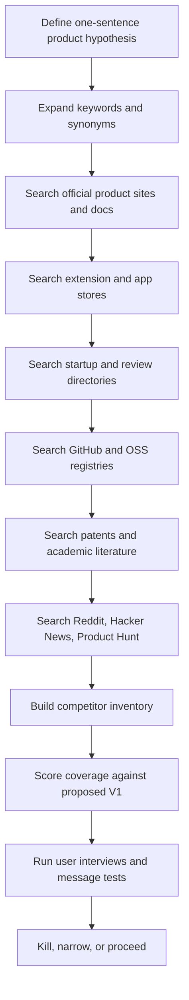
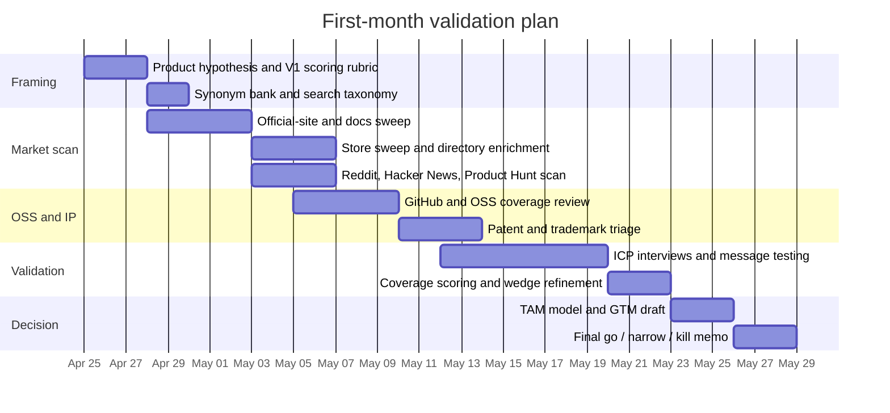

# Competitive Landscape Report for the Proposed Browser AI Companion

## Executive Summary

I reviewed the attached brainstorm and scoping materials as a proposal for a **local-first, vendor-neutral browser AI companion** that coordinates work across chat surfaces, preserves context in an Obsidian-style knowledge base, and exposes memory outward to coding agents through MCP. Read that way, the idea is **not** a generic “AI browser.” It is a **workflow switchboard + memory ledger + notebook anchor**. That framing matters, because the public market is now crowded in adjacent directions: browser-native assistants are being pushed by entity["company","OpenAI","ai company"], entity["company","Anthropic","ai company"], entity["company","The Browser Company","browser startup"], and entity["company","Perplexity","ai search company"], while cross-provider memory layers are being pushed by newer memory products and agent-memory platforms. citeturn14view0turn14view1turn12view1turn13view4turn12view2turn13view5turn12view3turn24search2turn12view5turn12view6turn12view7

The strongest conclusion from the current landscape is that your idea is **still viable**, but only if the product is defined by a **combination** of capabilities rather than a single feature. The clearest durable wedge is the intersection of: **cross-provider coordination, local-first storage, notebook-canonical artifacts, provenance, portable context packs, and MCP-out for coding agents**. Individual competitors cover one or two of those axes well; I did not find a single public product that clearly covers all of them together from official materials. The closest direct overlap is AI Context Flow on cross-provider memory, while Atlas and Claude in Chrome are the biggest threats on browser-native action and assistant UX. citeturn12view4turn24search2turn24search1turn14view0turn14view3turn12view1turn13view2turn13view4turn23view2

The report’s operational recommendation is therefore to **validate the market against the attached docs’ narrowest credible MVP**, not against the entire brainstorm universe. In practice, that means testing whether a focused ICP actually values: **multi-provider thread visibility, recall of prior work, notebook-backed capture with provenance, and context-pack handoff to coding agents**. If users only want “an AI browser” or “memory across chat tools,” the market is already crowded. If they want **vendor-neutral continuity with user-owned artifacts**, there is still room. citeturn14view0turn14view3turn12view4turn12view5turn13view6turn12view6turn30view4

My practical recommendation is to prioritize **official product sites and official docs first**, then **extension/app stores**, then **startup and review directories**, then **GitHub/open-source**, then **forums and social proof**, and only then build a kill-or-continue memo. That sequence gives you the best signal-to-noise ratio for “does this already exist?” and “does it exist strongly enough to make this a bad bet?” citeturn21view5turn21view4turn20view7turn20view3turn20view4turn21view2turn21view0turn21view9

## Reading of the Attached Brainstorm and Scoping Docs

My reading of the attached materials is that the proposal is best defined as:

> A **local-first AI workflow switchboard** that observes, captures, recalls, dispatches, and rehydrates user work across AI chats, browser tabs, notes, and coding agents—without making a new foundation model or forcing users into one assistant.

That reading implies a narrower, sharper validation target than “any AI extension.” The open-ended variables remain genuinely open and should stay that way until the first month of research is complete:

| Hypothesis area | Current status from the docs | How to treat it now |
|---|---|---|
| Domain | Unspecified | Keep broad; test across research, coding, PM, writing, and analyst workflows |
| ICP | Implied power user / multi-tool AI user | Treat as a hypothesis and narrow only after interviews and usage-mapping |
| Budget | Unspecified | Assume constrained and favor reuse over reinvention |
| Timeline | Unspecified | Use a 30-day validation cycle before locking scope |
| Geography | Unspecified | Prioritize English-speaking markets first |
| Platform | Browser-centric, desktop-heavy | Assume Chromium-first for validation; do not assume mobile matters yet |
| Monetization | Unspecified | Test willingness to pay only after proving retention-worthy workflows |

The attached documents also imply that competitor analysis should be scored against a **thin V1 spine**, not the broader scenario catalog. In market terms, the critical public questions become:

1. Does a product already unify **multiple AI providers** rather than just one?
2. Does it keep artifacts **local and user-owned** rather than trapped in a cloud app?
3. Does it write to a notebook or durable file system, rather than keeping “memory” inside the product?
4. Does it preserve **provenance and workstream state**, not just snippets?
5. Does it expose memory outward to coding agents through **MCP** or another machine-readable interface?

That is the right lens for the rest of this report.

## Validation Methodology and Search Strategy

### Process flow



The most reliable search sequence is to begin with **official sources**, then widen outward. Official product pages are the best first-pass source for what a product claims to do; app and extension stores are the best source for discoverability, category placement, ratings, and screenshots; Crunchbase and similar databases are best for company/funding enrichment; GitHub is best for technical depth and open-source substitutes; patent and academic search help establish novelty and prior-art risk. citeturn21view5turn21view4turn20view7turn11search3turn21view2turn18view1turn21view6turn21view7turn21view8turn21view3

### Search surfaces to prioritize

| Search surface | Why it matters | What you should look for first | Evidence threshold before you move on |
|---|---|---|---|
| Official product sites and docs | Best source for current positioning, features, privacy, platform support, pricing hooks | Product promise, supported platforms, integrations, privacy claims, pricing entry points | Official site + help docs for every serious hit |
| Chrome Web Store / Apple App Store / Google Play | Best source for discoverability, reviews, screenshots, and user phrasing | App titles, keywords, categories, ratings/reviews, screenshots, change notes | At least the top 20 relevant extension/app hits |
| Crunchbase | Best source for funding and company enrichment | Founded date, funding rounds, investors, category tags | Fill for every serious commercial competitor |
| Product Hunt | Good for launch history and maker narratives | Launch date, comments, adjacent alternatives, positioning language | Capture every relevant launch, not just winners |
| G2 / Capterra | Useful for category mapping and user-review signals | Category placement, review themes, alternatives, pricing patterns | For B2B-oriented products only |
| GitHub / OSS registries | Best source for cloneability and DIY substitutes | License, activity, stars, architecture, issues, forks | Review top OSS repos plus activity/maintenance |
| Google Scholar | Best source for adjacent research and vocabulary | Prior-art terminology, similar problem framing, authors and labs | Use when the idea sounds technically novel |
| Google Patents / USPTO / EPO | Best source for patent novelty and FTO triage | Exact phrases, assignee names, inventors, classifications, cited art | Enough hits to establish risk clusters |
| Reddit / Hacker News | Best source for pain intensity, complaints, and DIY workarounds | “I keep repeating context,” “best AI memory,” “Obsidian + Claude” | At least 20–30 relevant threads/comments |
| General web search | Best source for breadth and long tail | Niche products, blog launches, articles, marketplace pages | Use continuously for synonym expansion |

Official documentation confirms that Apple search uses metadata, category, ratings/reviews, and customer behavior; Google Play search depends heavily on thorough store listings; Google Search supports exact-match quotes, `site:`, and exclusion with `-`; Google Scholar supports author search, exact-title quotes, date filtering, and alerts; GitHub supports exact-string, boolean, and topic/repository exploration; Reddit supports `AND`, `OR`, `NOT`, grouping, and manual filters like `author:`, `site:`, `subreddit:`, and `title:`. citeturn20view2turn21view4turn18view9turn21view3turn21view2turn18view1turn21view0turn18view2

### Keyword and synonym expansion

For an unspecified domain, build the query bank from **jobs-to-be-done**, **interface words**, **user language**, and **adjacent-market language**. Start with four buckets:

| Bucket | Examples |
|---|---|
| User problem terms | `repeat context`, `AI amnesia`, `lost thread`, `where was I`, `cross-tool memory`, `research continuity` |
| Product-shape terms | `AI browser`, `browser copilot`, `AI sidebar`, `agentic browser`, `chat overlay`, `context switchboard` |
| Workflow terms | `highlight dispatch`, `context pack`, `thread rehydration`, `prompt provenance`, `multi-model compare`, `browser-to-notebook` |
| Adjacent-market terms | `web clipper`, `annotation`, `knowledge graph memory`, `personal web memory`, `tab manager`, `research assistant` |

Use the query bank in waves:

1. **Direct language**: use your own product words.
2. **User pain language**: use what a buyer would say.
3. **Competitor language**: use the labels competitors use.
4. **Technical implementation language**: use terms like “MCP,” “knowledge graph,” “browser extension,” “Obsidian,” “long-term memory.”
5. **Alternative framing**: “annotation,” “personal search,” “browser history copilot,” “agent memory.”

### Example search queries and Boolean patterns

#### Web search

Supported mechanics on Google include quotes for exact phrases, `site:` for domain restriction, and `-` for exclusions. citeturn18view9

| Goal | Example query |
|---|---|
| Direct competitor sweep | `"cross-provider AI memory" OR "universal AI memory" OR "AI browser memory"` |
| Browser-native assistant sweep | `("AI browser" OR "browser copilot" OR "agentic browser") ("chat with tabs" OR "side panel" OR "web assistant") -jobs -news` |
| Vendor-neutral workflow tools | `("ChatGPT" OR "Claude" OR "Gemini") ("memory" OR "context" OR "sidebar" OR "compare") "browser extension"` |
| Obsidian-adjacent tools | `("Obsidian" AND ("AI" OR "browser extension" OR "web clipper" OR "MCP"))` |
| Official-only verification | `site:openai.com Atlas browser`, `site:anthropic.com "Claude in Chrome"`, `site:obsidian.md clipper` |

#### Chrome Web Store, App Store, and Google Play

Apple says App Store search surfaces apps through metadata, categories, ratings/reviews, and customer behavior; Google says Play discovery depends on a thorough and optimized store listing. citeturn20view2turn21view4

| Surface | Example query patterns |
|---|---|
| Chrome Web Store | `ChatGPT Claude Gemini memory`, `AI sidebar`, `compare AI responses`, `Obsidian web clipper`, `browser assistant`, `prompt memory` |
| Apple App Store | `AI browser`, `personal AI assistant browser`, `research assistant`, `memory assistant`, `knowledge base AI` |
| Google Play | `AI browser`, `cross-AI memory`, `research memory`, `web clipping`, `chat with tabs`, `multi model compare` |

#### Google Scholar

Google Scholar supports `author:`, exact-title quotes, date filtering, “Cited by,” related articles, and alerts. citeturn21view3turn19view3turn19view4

| Goal | Example query |
|---|---|
| Vocabulary discovery | `"personal knowledge management" browser memory AI` |
| Prior-art research | `("long-term memory" OR "persistent memory") ("AI assistant" OR "LLM agent")` |
| Browser workflow framing | `"browser extension" context provenance annotation` |
| Author tracking | `author:"your key researcher" "agent memory"` |
| Alerts | Save your best 3–5 queries and turn alerts on |

#### Patents

The USPTO recommends brainstorming alternative words, starting broad with keyword search, then expanding using CPC classifications and cited references. Google Patents supports exact phrases plus `assignee:`, `inventor:`, and date filters like `before:`; it also lets you include non-patent literature from Scholar. Espacenet supports field identifiers such as `ti`, `ab`, `ta`, `pa`, and `in`, along with boolean operators. citeturn21view6turn18view6turn21view7turn21view8turn2search7

| Surface | Example pattern |
|---|---|
| Google Patents | `"browser extension" "long-term memory" assignee:"Anthropic"` |
| Google Patents | `"context pack" "chat" before:2026` |
| Google Patents | `"AI browser" "assistant" assignee:"OpenAI"` |
| USPTO Patent Public Search | Start broad with core terms, then refine with a discovered CPC pattern: `<relevant CPC>.cpc AND "browser" AND "memory"` |
| Espacenet | `ta="browser extension" AND ta=memory`, `pa=anthropic AND ta=browser`, `in="inventor name" AND ta=assistant` |

#### GitHub

GitHub code search supports exact strings, boolean logic, and qualifiers; GitHub topics help you discover projects by subject area. citeturn21view2turn18view1

| Goal | Example query |
|---|---|
| OSS direct analogs | `"browser extension" AND ("memory" OR "context") AND ("chatgpt" OR "claude" OR "gemini")` |
| Context-pack style artifacts | `"context pack" OR "memory bucket"` |
| MCP-related substitutes | `"mcp" AND ("browser" OR "memory" OR "obsidian")` |
| Topic browse | `topic:obsidian`, `topic:browser-extension`, `topic:model-context-protocol`, `topic:knowledge-graph` |

#### Reddit

Reddit supports boolean operators and manual filters such as `author:`, `site:`, `subreddit:`, and `title:`. citeturn21view0turn18view2

| Goal | Example query |
|---|---|
| Pain-language discovery | `("repeat context" OR "AI amnesia") AND (ChatGPT OR Claude)` |
| Community-specific discovery | `subreddit:ObsidianMD (Claude OR ChatGPT OR Gemini) memory` |
| OSS hunting | `subreddit:LocalLLaMA site:github.com "browser memory"` |
| Competitor reviews | `title:"AI Context Flow" OR title:"ChatHub" subreddit:SideProject` |

#### Hacker News

Algolia’s HN Search API is the practical search layer for Hacker News and is useful for launch history, technical criticism, and DIY alternatives. citeturn21view9turn8search1

| Goal | Example query |
|---|---|
| Launches | `"Show HN" "browser memory"` |
| Product category | `"agentic browser"`, `"AI browser"`, `"Obsidian AI"` |
| DIY and OSS alternatives | `"MCP browser"`, `"knowledge graph memory"` |

### Step-by-step checklist with minimum evidence

| Action | Tools | Minimum evidence before marking complete |
|---|---|---|
| Write a one-sentence product hypothesis | Internal doc | One sentence plus three alternate phrasings |
| Build a synonym bank | Search notes | At least 30 terms across problem, product, workflow, and adjacent markets |
| Run official-site sweep | Google + official sites | 10–20 serious hits with official pages saved |
| Run extension/app-store sweep | Chrome Web Store, App Store, Google Play | Top 20 relevant listings captured |
| Enrich commercial competitors | Crunchbase, official pricing/help pages | Founding/funding/pricing/business model filled for every serious commercial hit where public data exists |
| Scan review/category surfaces | G2, Capterra, Product Hunt | Categories and user-review themes captured for B2B-facing products |
| Scan OSS substitutes | GitHub, MCP registries | Top 10–15 relevant repos reviewed for license, activity, and coverage |
| Scan community pain and DIY stacks | Reddit, Hacker News | 20–30 relevant threads/comments summarized |
| Search prior art | Google Scholar, Google Patents, USPTO, EPO | Vocabulary map plus at least one patent-risk memo |
| Score coverage | Master matrix | Every serious competitor scored against your V1 axes |
| Validate with users | Interviews / demos | 8–12 interviews or demo-based reactions from target ICP candidates |
| Write decision memo | Internal doc | Clear go / narrow / kill recommendation |

### Search log template

| Date | Surface | Query | Hypothesis tested | Top hits | Classified as | Evidence quality | Next action |
|---|---|---|---|---|---|---|---|
| 2026-04-25 | Web | `"cross-provider AI memory" browser extension` | Do direct portable-memory tools already exist? | AI Context Flow, OpenMemory, MemoryPlugin | Direct | High | Enrich pricing and privacy |
| 2026-04-25 | GitHub | `"browser extension" AND "memory" AND "mcp"` | Is there a DIY stack that covers the idea? | mcp-chrome, mcp-memory-service | OSS / DIY | High | Review licenses and activity |
| 2026-04-25 | Scholar | `"persistent memory" "AI assistant"` | Is there academic prior art vocabulary I should adopt? | TBD | Adjacent research | Medium | Add terminology to query bank |

## Competitive Landscape and Coverage Analysis

### What the public market says

The attached docs are directionally right: the market has split into at least four visible clusters. First, **browser-native assistants** such as Atlas, Claude in Chrome, Dia, and Comet are competing to own the “AI inside the browser” experience. Second, **cross-provider memory layers** such as AI Context Flow, OpenMemory/Mem0, MemoryPlugin, and Supermemory are competing to own “persistent context across tools.” Third, **multi-model compare/orchestration tools** such as ChatHub and LLM Council are competing on “ask several models at once.” Fourth, **adjacent capture and memory tools** such as Obsidian Web Clipper, Promnesia, and Pieces compete for pieces of the underlying workflow without looking identical on the surface. citeturn14view0turn12view1turn12view2turn12view3turn12view4turn12view5turn12view6turn12view7turn12view8turn12view9turn28search0turn28search1

That segmentation matters because it tells you what **not** to say. If you position the product as “an AI browser,” you run directly into Atlas, Claude in Chrome, Dia, and Comet. If you position it as “portable AI memory,” you run directly into AI Context Flow, OpenMemory, MemoryPlugin, and Supermemory. The attached docs’ best move is therefore to position the product as **the vendor-neutral memory-and-routing layer for people whose work already spans multiple AI tools, browser tabs, notes, and coding agents**. That is more precise, more defensible, and more compatible with the V1 spine emerging in your materials. citeturn14view0turn14view3turn13view4turn12view4turn12view5turn13view6turn12view6

### Current competitor coverage matrix

Legend: **High** = clearly covered from current public materials; **Medium** = partially covered or implied; **Low** = weak/indirect; **None** = not evident from current public materials.

| Product | Market cluster | Cross-provider memory | Browser-native action | Local-first / user-owned data | Notebook anchor | MCP / coding-agent interoperability | Provenance / workstream state / handoff | Strategic read |
|---|---|---:|---:|---:|---:|---:|---:|---|
| ChatGPT Atlas | Browser-native assistant | Low | High | Low | None | Low | Medium | Strong threat on browser actions and built-in memory, weak on vendor-neutrality |
| Claude in Chrome | Browser-native assistant | Low | High | Low | None | Medium | Medium | Strong threat on web automation and dev workflows |
| Dia | AI browser | Low | Medium | Low | None | Low | Low | Strong UX competitor, weak direct overlap with notebook-backed coordination |
| Comet | AI browser | Low | High | Low | None | Low | Low | Broad assistant threat, not a direct notebook/memory substitute |
| AI Context Flow | Cross-provider memory | High | Medium | Medium | None | Medium | Medium | **Closest direct overlap** from current public evidence |
| OpenMemory / Mem0 extension | Cross-provider memory | High | Low | High | None | Medium | Low | Strong memory overlap, weaker orchestration; maintenance risk matters |
| MemoryPlugin | Cross-provider memory | High | Low | Medium | None | Medium | Medium | Strong imported-history and cross-tool memory overlap |
| Supermemory | Memory infrastructure | High | Low | Medium | None | High | Medium | Strong platform/API competitor more than direct browser UX competitor |
| ChatHub | Multi-model compare | Medium | Low | Low | None | Low | Low | Useful adjacent competitor; not a deep memory/workstream substitute |
| Obsidian Web Clipper | Capture / PKM | None | Low | High | High | None | Medium | Adjacent capture incumbent; reason not to rebuild generic clipping |
| Promnesia | Personal web memory | Medium | Low | High | Medium | None | Medium | Non-obvious memory/history competitor for technical users |
| Pieces | OS-level memory | Medium | Low | Medium | None | Medium | Medium | Non-obvious “remember my work” competitor outside the browser layer |

**Evidence basis for the matrix.** Atlas publicly emphasizes built-in browser memory, an Ask sidebar, and agent mode; Claude in Chrome emphasizes side-panel browsing, automation, scheduled tasks, multi-tab workflows, and Chrome/CLI integration; Dia emphasizes “chat with your tabs” and privacy controls; Comet emphasizes personal-assistant browsing across multiple platforms; AI Context Flow emphasizes shared memory, memory buckets, a sidebar, and cross-platform continuity; OpenMemory/Mem0 emphasizes a lightweight client-side memory layer across browser AI tools but its Chrome extension repository was archived in March 2026; MemoryPlugin emphasizes imported chat history, buckets, retrieval filtering, and support for 17+ tools; Supermemory emphasizes an API, plugins, and a personal memory app; ChatHub emphasizes simultaneous use of multiple chatbots with free and premium tiers; Obsidian Web Clipper emphasizes durable offline capture into a vault; Promnesia emphasizes contextual browsing history; Pieces emphasizes OS-level memory across apps. citeturn14view3turn12view1turn13view2turn13view4turn23view2turn12view2turn13view5turn12view3turn12view4turn24search2turn12view5turn4search15turn12view7turn12view6turn14view7turn30view4turn12view9turn28search0turn28search1

### The closest threats and what they cover

#### AI Context Flow

AI Context Flow is the most important direct comparator because it already claims **one memory layer across ChatGPT, Claude, Gemini, Grok, Perplexity, and more**, with memory buckets, context switching, and a built-in sidebar; its public materials also point to an Open Context MCP pattern. That gives it real overlap on the “portable context across AI tools” story. What is *not* evident from public materials is a strong emphasis on **user-owned notebook artifacts, signed provenance, workstream state, or a notebook-as-canonical-source architecture**. That means your concept should not compete with it on generic “portable memory”; it should compete on **durable artifacts and workflow state**. citeturn12view4turn24search2turn24search1turn4search12

#### Atlas and Claude in Chrome

Atlas and Claude in Chrome are the biggest threats if you drift toward “AI that acts in the browser.” Atlas already offers browser memories, an Ask sidebar, and agent mode for research, browsing, and taking actions in the browser. Claude in Chrome already offers browser control, scheduled tasks, multi-tab workflows, background execution, and direct interoperability with Claude Code. That means you should assume the **browser-control layer is being commoditized by platform vendors**. The attached docs are strongest when they avoid that head-on fight and instead own the **cross-provider continuity** those platforms do not currently promise. citeturn14view0turn14view1turn14view3turn12view1turn13view2turn13view4turn23view2

#### MemoryPlugin, OpenMemory, and Supermemory

These products together show that **cross-tool memory is no longer a greenfield market**. MemoryPlugin is substantial because it explicitly sells years-of-chat-history import, context buckets, retrieval filtering, and support for many AI tools including Claude Code; Supermemory is substantial because it sits lower in the stack as an API/platform with plugins, connectors, and a personal app; OpenMemory is important because it proves there is demand for a lightweight local layer in the browser, although its archived extension repo is now a diligence concern. The implication is simple: if your value proposition is just “AI remembers more,” that will be too weak. If your value proposition is “your browser work becomes a durable, queryable, notebook-backed graph,” that is still differentiated. citeturn12view7turn13view6turn12view6turn14view7turn12view5turn4search15

### What to say in positioning

The strongest positioning sentence implied by both the attached docs and the public market is:

> **A vendor-neutral browser workflow layer that turns multi-AI work into durable, notebook-backed, provenance-rich context that both humans and coding agents can reuse.**

That language avoids the crowded “AI browser” category, avoids the already-occupied “universal AI memory” category, and focuses on the intersection current competitors do not clearly own.

### Canonical master competitor table template

Use this as the **system of record** for the commercial landscape. Keep it in a spreadsheet, not a document.

| Name | URL | Category | Founded date | Funding | Geography | Target user | Business model | Pricing | Primary jobs-to-be-done | Core features | Integrations | Tech stack signals | Privacy / storage model | User-review summary | Strengths | Weaknesses | Differentiation opportunities | Source confidence | Last verified |
|---|---|---|---|---|---|---|---|---|---|---|---|---|---|---|---|---|---|---|---|
| Example competitor |  |  |  |  |  |  |  |  |  |  |  |  |  |  |  |  |  | High / Med / Low | YYYY-MM-DD |

### Feature and pricing matrix template

| Capability / dimension | Your product | Competitor A | Competitor B | Competitor C | Notes |
|---|---|---|---|---|---|
| Multi-provider support |  |  |  |  |  |
| Browser-side observation |  |  |  |  |  |
| Browser automation |  |  |  |  |  |
| Local-first storage |  |  |  |  |  |
| Notebook / vault integration |  |  |  |  |  |
| Provenance / citations |  |  |  |  |  |
| Workstream registry |  |  |  |  |  |
| Context-pack export |  |  |  |  |  |
| MCP / coding-agent output |  |  |  |  |  |
| Redaction / safety preflight |  |  |  |  |  |
| Free tier |  |  |  |  |  |
| Entry paid plan |  |  |  |  |  |
| Enterprise motion |  |  |  |  |  |

## Open-Source Analogs and Coverage Gaps

### What open source already covers

The OSS landscape is rich enough that you should assume a technical user can assemble a meaningful DIY substitute. The most useful current building blocks are: **Obsidian Local REST API** for authenticated vault access, **Obsidian Web Clipper** for durable capture, **Defuddle** for readable markdown extraction, **mcp-chrome** for model/browser control, **mcp-memory-service** for open memory and knowledge-graph patterns, and broader projects like **BrowserOS** and **Promnesia** that cover adjacent parts of the workflow. At the same time, the official MCP reference-server repository explicitly says its examples are educational and not production-ready, so “MCP support exists” should not be confused with “a production-quality memory substrate exists off the shelf.” citeturn23view5turn23view7turn23view6turn23view3turn23view4turn25search8turn28search0turn23view0

### OSS coverage matrix

| OSS project | What it clearly covers | License / maturity signal | What it does **not** cover for your concept | Recommendation |
|---|---|---|---|---|
| Obsidian Local REST API | Secure authenticated read/write access to an Obsidian vault | MIT; active releases signal maturity | No workstream model, no browser observation, no AI orchestration | **Adopt** |
| Obsidian Web Clipper | Durable offline page capture into a vault | MIT; official Obsidian project | No cross-provider memory, no orchestration | **Coexist; do not rebuild generic clipping** |
| Defuddle | Clean content extraction to HTML/Markdown | MIT; purpose-built for clipping | No memory, no workflow state | **Adopt or borrow** |
| mcp-chrome | Browser control, local browser reuse, cross-tab context, semantic search | MIT; early-stage but high OSS traction | No notebook anchor, no provenance model | **Borrow patterns carefully** |
| mcp-memory-service | Persistent memory, knowledge graph, autonomous consolidation | Apache-2.0 | More agent-pipeline-oriented than end-user browser UX | **Borrow ideas; probably not a direct dependency** |
| MCP reference servers / server-memory | Reference examples for MCP patterns | Official but explicitly educational | Not production-ready; minimal end-user workflow features | **Reference only** |
| BrowserOS | Open-source agentic browser with local/privacy-first posture | AGPL-3.0; active releases | Browser-fork scope is much broader; copyleft implications are material | **Monitor, do not build on casually** |
| Promnesia | Contextual browsing history and personal web memory | MIT | No AI orchestration, no notebook-canonical graph | **Use as inspiration for recall UX** |
| Hypothesis client | Mature web annotation patterns | BSD-2-Clause | No AI workflow coordination | **Borrow anchoring patterns if needed** |
| OpenMemory / Mem0 Chrome extension | Lightweight local browser memory across assistants | Repo archived in 2026; maintenance risk | Archival status undermines dependence; orchestration is limited | **Study, but avoid dependency** |

**Evidence basis for the OSS matrix.** The Obsidian Local REST API repo describes a secure authenticated REST API into the vault; the Obsidian Web Clipper repo and help pages emphasize durable offline markdown capture; Defuddle is the markdown-extraction library created for Obsidian Web Clipper; mcp-chrome emphasizes local browser reuse, cross-tab context, semantic search, and MIT licensing but also says it is still in early stages; mcp-memory-service emphasizes persistent memory and knowledge-graph patterns under Apache-2.0; the official MCP servers repo explicitly warns that its reference servers are educational examples, not production-ready; BrowserOS presents itself as an open-source, privacy-first agentic browser under AGPL; Promnesia emphasizes contextual browsing history and memory; the Hypothesis client is BSD-2-Clause; the OpenMemory/Mem0 extension repo was archived in March 2026. citeturn23view5turn23view7turn23view6turn23view3turn23view4turn23view0turn25search8turn28search0turn25search1turn4search15

### Coverage gaps the OSS landscape still leaves open

The most important finding from the open-source review is that **you do not need to build the whole stack**, but you also **cannot simply stitch together one repo and call the product done**. The biggest gaps that remain relatively uncovered are:

| Gap | Why it still matters |
|---|---|
| Signed, append-only event log of browser AI work | Existing tools capture context, but not a durable, attributable workflow ledger |
| Notebook-canonical workstream state | Existing tools store snippets or memories, not a first-class rehydratable workstream model |
| Provenance-preserving dispatch across multiple AI providers | Existing memory tools skew toward recall, not traceable routing |
| Human-readable context-pack handoff | Existing tools capture and retrieve; fewer package and transfer context cleanly |
| MCP-out from browser memory into coding agents | Parts exist, but not a polished notebook-backed browser-memory bridge |
| Safety preflight and redaction as a first-class workflow primitive | Browser AI and memory tools make this important, but few make it central |

That is the part of the opportunity I would still call “open.”

### OSS analysis template

| Repo / project | URL | License | Stars / activity | Core primitives covered | Missing primitives | Maturity risk | License risk | Integration complexity | Adopt / fork / rewrite | Notes |
|---|---|---|---|---|---|---|---|---|---|---|
| Example |  |  |  |  |  | Low / Med / High | Low / Med / High | Low / Med / High | Adopt / Fork / Rewrite |  |

## Market Fit, Sizing, Channels, and IP Risk

### Market-fit test before TAM

If the domain is truly open-ended, **market fit should be tested as a workflow hypothesis, not as a category hypothesis**. That means you should interview and prototype around narrow jobs such as:

- “I use more than one AI tool every week and lose track of what happened where.”
- “I want prior work to come back automatically when I am in a similar task.”
- “I want browser research to land in a durable notebook, not vanish in tabs.”
- “I want Claude Code / Cursor / Codex to see my prior research without manual copy-paste.”

If prospective users do not care about at least two of those jobs strongly enough to change behavior, the idea should narrow or stop. If they do care, then TAM work becomes worth doing.

### TAM, SAM, and SOM approach

Because the target user is not yet fixed, use **three models in parallel** and compare them.

| Model | Formula | Best use |
|---|---|---|
| Top-down | `Large category size × percent with the problem × willingness to pay` | Quick sanity check |
| Bottom-up | `Reachable customer count × expected conversion × ACV` | Go-to-market planning |
| Value-based | `Hours/month saved × value of time × share captured in price` | Pricing sanity check |

The assumptions you need to collect before trusting any market-size number are:

| Assumption | Why it matters |
|---|---|
| How many users regularly use 2+ AI tools in one workflow | Core denominator |
| How many of those users are desktop/browser-heavy | Platform fit |
| How many of those users already keep a notebook or PKM system | Notebook anchor fit |
| How many are willing to connect local notes to AI workflows | Privacy / setup friction |
| How many also use coding agents or dev tooling | MCP-out relevance |
| Time lost per week to context switching and repetition | Economic value |
| Existing spend on AI/browser/PKM tools | Budget context |
| Required trust bar for local-first vs cloud-first | Messaging and packaging |

A placeholder TAM stack for this project should look like this:

```text
TAM  = All English-first knowledge workers / developers who use AI-assisted workflows
SAM  = Those who are desktop/browser-heavy and regularly use 2+ AI tools
SOM  = Those reachable early through Obsidian, developer, and coding-agent channels
```

Sample visual, using placeholders only:

```text
TAM  [████████████████████████████] 100%
SAM  [███████████-----------------] 20–40% of TAM
SOM  [██--------------------------] 1–5% of SAM in early years
```

### Go-to-market channels

The right GTM channels depend on whether the first wedge is **Obsidian power users**, **multi-AI researchers**, or **coding-agent users**. For the proposal in the attached docs, I would prioritize channels in this order:

| Channel | Why it fits | What success looks like |
|---|---|---|
| Obsidian community | Best match for notebook-canonical, local-first users | Strong qualitative pull and integrations feedback |
| Show HN / developer communities | Best match for multi-tool technical workflows and OSS-minded users | Clear replies of “I already need this” or strong DIY comparisons |
| Claude Code / Cursor / Codex communities | Best match if MCP-out is truly differentiating | People try it because it reduces copy-paste into agents |
| Chrome Web Store | Good distribution, weak initial ICP precision | Acceptable only after message is clear |
| Reddit communities | Useful for pain discovery and launch iteration | Repeated, specific workflow resonance |
| Product Hunt | Useful later as amplification, not as core validation | Visibility after positioning is already sharp |

Product Hunt’s own launch guide confirms it is a launchpad for prep, community building, and launch execution; that is useful, but for a technical local-first product I would still treat it as **amplification**, not primary discovery. citeturn20view5turn20view6

### Non-obvious competitors and how to detect them

Non-obvious competition is where many validation efforts fail. In this category, you should actively look for:

| Non-obvious competitor type | Why it matters | How to detect it |
|---|---|---|
| Adjacent memory tools | Users do not care whether a tool calls itself “AI memory” | Search pain language, not product language |
| OS-level memory tools | Some users want memory across all apps, not just browsers | Track Pieces-like products and desktop assistants |
| Browser-history and personal-search tools | “Remember where I saw this” may be good enough | Look at Promnesia-style tools, archives, search-over-history tools |
| Generic AI browsers | Users may accept single-vendor lock-in if UX is good enough | Track Atlas, Claude in Chrome, Dia, Comet closely |
| DIY stacks | Technical users may compose 70% of the value from OSS | Search GitHub + Reddit + HN for “my stack” discussions |
| Capture tools | Users may only need clipping and retrieval, not orchestration | Scan clippers, annotators, and PKM integrations |
| Coding-agent integrations | The real buyer may be the person already living in Claude Code or Cursor | Search MCP registries, coding-agent docs, and communities |

The most important non-obvious competitor in your likely early ICP is the **DIY stack**: Obsidian + Web Clipper + a browser agent + an MCP memory server + custom scripts can approximate a large portion of the value for a technical user. That means your product must win on **integration quality, provenance, and rehydration speed**, not merely on capability checkboxes. citeturn23view5turn23view7turn23view3turn23view4turn23view0

### Patent and IP risk assessment

The minimal freedom-to-operate path here is not heavy lawyering up front; it is disciplined triage. The USPTO’s own search strategy is to brainstorm terms, search broadly, review similar patents deeply, then expand by CPC classifications and cited references. Google Patents adds practical support for exact phrases, assignee/inventor filters, date filters, and non-patent literature; WIPO’s public-domain and FTO guides are useful for interpreting whether a technology area is crowded and how to think about FTO step by step. Trademark search must be run separately for the product name. citeturn21view6turn18view6turn21view7turn26view0turn26view1turn26view2

A minimal FTO checklist for this project should include:

| Step | What to do | Why |
|---|---|---|
| Patent term brainstorming | Build a vocabulary map with synonyms and implementation terms | Avoid missing prior art through terminology mismatch |
| Keyword search | Search Google Patents and USPTO broadly | Establish the rough novelty landscape |
| Classification expansion | Move into CPC-driven searches | Find patents that use different wording |
| Assignee search | Search likely incumbents and adjacent vendors | Identify concentrated risk clusters |
| Cited-reference review | Review backward and forward citations | Find the real patent families that matter |
| Foreign search | Check Espacenet/EPO | U.S.-only search is too narrow |
| Non-patent literature | Include Scholar and technical papers | Some novelty is already published outside patents |
| Trademark clearance | Search proposed product and feature names | Avoid name collision and rebrand cost |
| OSS license audit | Review every dependency’s license and obligations | Copyleft or attribution issues can change architecture choices |
| Counsel review | Escalate only if product direction survives first-month validation | Keep legal spend proportional |

### IP risk register template

| Risk | Type | Affected scope | Likelihood | Impact | Initial trigger | Evidence found | Mitigation | Owner | Status |
|---|---|---|---|---|---|---|---|---|---|
| Example patent family | Patent | Browser memory / dispatch | Med | High | Keyword + assignee search | Patent family X | Narrow feature, design around, or review with counsel | Founder | Open |
| Example product name | Trademark | Branding | Low | Med | Trademark search | Similar mark in same class | Rename early | Founder | Open |
| Example OSS license | Copyright / license | Dependency stack | Med | High | GitHub repo audit | AGPL component in core path | Replace or isolate | Tech lead | Open |

## Thirty-Day Action Plan

### Deliverables and suggested formats

| Deliverable | Format | Why it matters |
|---|---|---|
| Search log | Google Sheet / Airtable | Prevents duplicate searching and makes the process auditable |
| Master competitor table | Spreadsheet | Single source of truth for the market map |
| Coverage heatmap | Spreadsheet or slide | Lets you see where the true wedge still exists |
| OSS landscape table | Spreadsheet | Identifies what to adopt, fork, or avoid |
| Patent and trademark memo | Brief doc | Keeps novelty and naming risk visible |
| TAM model | Spreadsheet | Forces assumptions into explicit cells |
| ICP interview notes | Doc + tagged note system | Converts qualitative signal into evidence |
| Decision memo | 2–4 page doc | Converts all research into a go / narrow / kill call |
| Launch-channel plan | 1-page memo | Keeps GTM tied to the actual wedge |
| Architecture risk memo | 1-page doc | Connects OSS, licensing, and coupling decisions |

### First-month timeline



### Concise first-month checklist

| Week | Must-have outcome |
|---|---|
| First week | One-sentence hypothesis, synonym bank, first competitor inventory |
| Second week | Master table filled for direct competitors and major adjacent competitors |
| Third week | OSS coverage matrix, IP triage memo, and at least 6–8 user conversations |
| Fourth week | Coverage heatmap, TAM assumptions sheet, GTM channel ranking, and a final decision memo |

### Actionable next steps

The first thing I would do next is **freeze the scoring rubric**. Evaluate every commercial and OSS alternative against the same six to eight dimensions the attached docs imply are strategic: cross-provider coordination, local-firstness, notebook-canonical artifacts, provenance, context-pack handoff, MCP-out, and safety. Without that rubric, the market scan becomes anecdotal.

The second thing I would do is **treat AI Context Flow as the benchmark direct competitor** and **Atlas / Claude in Chrome as the benchmark platform threats**. Those three comparison points will force discipline: if your concept cannot beat AI Context Flow on durable artifacts, cannot stay clearly differentiated from Atlas/Claude in Chrome on browser action, and cannot explain why a user should care about notebook-canonical memory, the idea is too blurry. citeturn12view4turn24search2turn14view0turn12view1

The third thing I would do is **turn the OSS review into a dependency policy**: adopt the Obsidian and extraction primitives, borrow from browser-control and memory repos carefully, avoid archived or ambiguous-maintenance dependencies, and treat AGPL browser forks as strategic references rather than default foundations. citeturn23view5turn23view7turn23view6turn23view3turn23view4turn25search8turn4search15

The fourth thing I would do is **write a short kill criterion now**: if the first month shows that users mostly want a single-vendor AI browser, or that AI Context Flow / MemoryPlugin already satisfy enough of the memory job, or that notebook-canonical provenance is only a nice-to-have, narrow the project drastically or stop. If the evidence shows users strongly value **cross-provider continuity with user-owned artifacts**, proceed.

### Open questions and limitations

A few fields that belong in the final diligence pack are intentionally incomplete in this report because public quality is uneven without case-by-case enrichment: exact founding dates, funding totals, and fully normalized pricing for several private competitors should still be filled from company profiles and databases such as Crunchbase during the next pass. Crunchbase does provide structured funding-round and funding-history views, so it is the right enrichment source once the serious competitor set is locked. citeturn20view7turn11search3

Also, several public product claims—especially around privacy, encryption, and how “local” a memory product really is—come from vendor-controlled pages. Treat those as **claims to verify hands-on**, not as final truth. That is especially important if local-first trust is going to be one of your core differentiators.